# BMAD Integration into cflow Platform Architecture Document

## Architecture Overview

### System Purpose
The BMAD Integration Architecture establishes a comprehensive technical foundation for integrating BMAD-METHOD (MIT) as the authoritative planning/PM/story core of the Cerebral platform. This architecture enables AI-powered planning optimization, collaborative planning intelligence, advanced project type intelligence, interactive planning experiences, voice-controlled planning, compliance checking, advanced elicitation, technical preferences, and sophisticated template processing while maintaining seamless integration with existing cflow platform infrastructure.

### Key Architectural Principles
- **Multi-User Cluster First**: All components designed for multi-user cluster deployment with horizontal scaling
- **AI-Powered Intelligence**: Leverage AI/ML for template selection, quality prediction, context-aware elicitation, and compliance checking
- **Collaborative by Design**: Real-time collaboration with conflict resolution and expertise-based routing
- **Quality Gate Enforcement**: Mandatory validation gates prevent premature development initiation
- **Seamless Integration**: Maintain compatibility with existing CAEF orchestration and cflow platform services
- **Security & Compliance**: HashiCorp Vault integration with SOC2/GDPR/HIPAA compliance
- **Performance & Scalability**: <200ms API response times with support for 10K+ concurrent users
- **Progressive Enhancement**: Core features work without advanced features, enabling phased implementation
- **Cost Optimization**: Maintain operational costs within 20% of baseline through efficient resource utilization
- **Accessibility First**: Comprehensive accessibility features for all advanced capabilities

### Architecture Diagram

```mermaid
graph TB
    subgraph "Frontend Layer"
        WEB[React Native Web]
        MOBILE[React Native Mobile]
        WEARABLE[React Native Wearable]
        VOICE[Voice Control Interface]
    end
    
    subgraph "API Gateway Layer"
        GATEWAY[API Gateway]
        AUTH[Authentication Service]
        RATE[Rate Limiting]
        COST[Cost Monitoring]
    end
    
    subgraph "BMAD Core Services"
        BMAD_API[BMAD HTTP API Facade]
        BMAD_CORE[BMAD Core Engine]
        TEMPLATE[Template Engine]
        WORKFLOW[Workflow Engine]
        HIL[HIL Session Manager]
        ELICITATION[Advanced Elicitation Engine]
    end
    
    subgraph "AI/ML Services"
        LLM[Hosted LLM APIs]
        EMBED[Ollama/Apple Silicon Embeddings]
        ML_MODELS[ML Models for Quality Prediction]
        TEMPLATE_AI[AI Template Selection]
        VOICE_AI[Voice Processing AI]
        COMPLIANCE_AI[Compliance Checking AI]
    end
    
    subgraph "Collaboration Services"
        COLLAB[Real-time Collaboration Engine]
        CONFLICT[Conflict Resolution Service]
        EXPERTISE[Expertise-Based Routing]
        GAMIFICATION[Gamification Engine]
    end
    
    subgraph "Advanced Features"
        VOICE_SVC[Voice Recognition Service]
        COMPLIANCE_SVC[Compliance Checking Service]
        PREFERENCES_SVC[Technical Preferences Service]
        TEMPLATE_PROC[Template Processing Engine]
    end
    
    subgraph "Data Layer"
        SUPABASE[(Supabase Database)]
        VAULT[HashiCorp Vault]
        S3[MinIO S3 Storage]
        REDIS[Redis Cache]
        VOICE_CACHE[Voice Processing Cache]
    end
    
    subgraph "Integration Services"
        CAEF[CAEF Orchestration]
        RAG[RAG/KG Indexing]
        WEBMCP[WebMCP Server]
        EXPANSION[Expansion Pack Manager]
    end
    
    WEB --> GATEWAY
    MOBILE --> GATEWAY
    WEARABLE --> GATEWAY
    VOICE --> GATEWAY
    
    GATEWAY --> AUTH
    GATEWAY --> RATE
    GATEWAY --> COST
    GATEWAY --> BMAD_API
    
    BMAD_API --> BMAD_CORE
    BMAD_API --> TEMPLATE
    BMAD_API --> WORKFLOW
    BMAD_API --> HIL
    BMAD_API --> ELICITATION
    
    BMAD_CORE --> LLM
    TEMPLATE --> TEMPLATE_AI
    WORKFLOW --> ML_MODELS
    HIL --> COLLAB
    ELICITATION --> LLM
    
    COLLAB --> CONFLICT
    COLLAB --> EXPERTISE
    COLLAB --> GAMIFICATION
    
    BMAD_API --> VOICE_SVC
    BMAD_API --> COMPLIANCE_SVC
    BMAD_API --> PREFERENCES_SVC
    BMAD_API --> TEMPLATE_PROC
    
    VOICE_SVC --> VOICE_AI
    COMPLIANCE_SVC --> COMPLIANCE_AI
    TEMPLATE_PROC --> LLM
    
    BMAD_CORE --> SUPABASE
    BMAD_CORE --> VAULT
    BMAD_CORE --> S3
    BMAD_CORE --> REDIS
    VOICE_SVC --> VOICE_CACHE
    
    BMAD_API --> CAEF
    BMAD_API --> RAG
    BMAD_API --> WEBMCP
    BMAD_API --> EXPANSION
```



## Technical Stack

### Frontend Technologies
- **React Native Web**: Cross-platform web development with consistent mobile experience
- **React Native Mobile**: Native mobile applications for iOS and Android
- **React Native Wearable**: Wearable device support for planning notifications and quick actions
- **Real-time Collaboration**: WebSocket connections for real-time document editing
- **Interactive Visualization**: D3.js for planning progress diagrams and team collaboration visualization
- **Voice Control**: Web Speech API for browser-based voice recognition
- **Accessibility**: ARIA compliance and screen reader support

### Backend Technologies
- **Python 3.11**: Core backend development with FastAPI framework
- **UV Package Management**: Modern Python package management with dependency resolution
- **FastAPI**: High-performance async web framework with automatic API documentation
- **Pydantic**: Data validation and serialization with type safety
- **SQLAlchemy**: ORM for database operations with async support
- **Alembic**: Database migration management
- **WebSocket**: Real-time communication for collaborative planning sessions

### AI/ML Technologies
- **Hosted LLM APIs**: OpenAI GPT-4, Anthropic Claude, Google Gemini for agent reasoning
- **Ollama**: Local LLM inference for privacy-sensitive operations
- **Apple Silicon MPS**: Hardware-accelerated embeddings and ML model inference
- **GPU Acceleration**: Hardware-agnostic support for any available GPU (NVIDIA, AMD, Apple Silicon)
- **Scikit-learn**: ML models for planning quality prediction and complexity assessment
- **TensorFlow/PyTorch**: Deep learning models for advanced AI features
- **Speech Recognition**: Google Speech-to-Text, Azure Speech Services for voice processing
- **Natural Language Processing**: spaCy, NLTK for advanced text processing

### Database & Storage
- **Supabase**: PostgreSQL database with real-time subscriptions and authentication
- **MinIO S3**: Self-hosted object storage for large documents and media files
- **Redis**: In-memory caching for session management and real-time collaboration
- **HashiCorp Vault**: Centralized secret management with encryption and access control
- **Vector Database**: ChromaDB for RAG/KG vector embeddings and semantic search
- **Voice Cache**: Redis-based caching for voice processing results

### Infrastructure & Deployment
- **Kubernetes**: Container orchestration for multi-user cluster deployment
- **Docker**: Containerization for consistent deployment across environments
- **Helm**: Kubernetes package management for service deployment
- **Istio**: Service mesh for traffic management and security
- **Prometheus**: Metrics collection and monitoring
- **Grafana**: Visualization and alerting for system metrics
- **Cost Monitoring**: Custom cost tracking and budget alerts

### Integration & Communication
- **WebMCP Server**: MCP protocol implementation for tool integration
- **REST APIs**: Standardized API endpoints for all service communication
- **WebSocket**: Real-time communication for collaborative planning sessions
- **Message Queues**: Redis Streams for asynchronous task processing
- **Event Sourcing**: Audit trail and event-driven architecture for planning workflows
- **Voice Processing**: Real-time speech-to-text and text-to-speech services

## System Architecture

### Service Architecture

#### BMAD Core Services
- **BMAD HTTP API Facade**: RESTful API endpoints exposing BMAD functionality
- **BMAD Core Engine**: Core planning logic and workflow management
- **Template Engine**: Dynamic template selection and document generation
- **Workflow Engine**: BMAD workflow execution with quality gate enforcement
- **HIL Session Manager**: Interactive session management with workflow pausing
- **Advanced Elicitation Engine**: 10 structured brainstorming actions and interactive refinement

#### AI/ML Services
- **LLM Integration Service**: Hosted LLM API management and response processing
- **Embedding Service**: Vector embedding generation for RAG/KG integration
- **ML Model Service**: Planning quality prediction and complexity assessment
- **AI Template Selection**: Context-aware template selection using ML models
- **Context-Aware Elicitation**: Adaptive question generation based on project context
- **Voice Processing AI**: Speech-to-text and natural language understanding
- **Compliance Checking AI**: ML-based code-to-planning verification

#### Collaboration Services
- **Real-time Collaboration Engine**: WebSocket-based document editing and synchronization
- **Conflict Resolution Service**: Automatic and manual conflict resolution for collaborative editing
- **Expertise-Based Routing**: Task assignment based on user expertise profiles
- **Gamification Engine**: Points, badges, achievements, and leaderboard management
- **Team Management Service**: User profiles, expertise tracking, and team collaboration

#### Advanced Features Services
- **Voice Recognition Service**: Speech-to-text processing with <500ms latency target
- **Compliance Checking Service**: Automated architecture pattern verification
- **Technical Preferences Service**: Persistent user profiles and preference-based recommendations
- **Template Processing Engine**: Sophisticated AI-only processing directives

#### Integration Services
- **CAEF Integration Service**: Seamless handoff from planning to development
- **RAG/KG Indexing Service**: Document indexing and semantic search
- **WebMCP Server**: MCP protocol implementation for tool integration
- **Expansion Pack Manager**: Dynamic loading and management of BMAD expansion packs

### Database Schema

#### Core Tables
```sql
-- Documents table supporting all BMAD document types
CREATE TABLE cerebral_documents (
    id UUID PRIMARY KEY DEFAULT uuid_generate_v4(),
    project_id UUID NOT NULL,
    kind TEXT NOT NULL CHECK (kind IN ('PRD', 'ARCH', 'STORY', 'EPIC', 'TECH_RESEARCH')),
    status TEXT NOT NULL DEFAULT 'draft' CHECK (status IN ('draft', 'review', 'approved', 'rejected')),
    title TEXT NOT NULL,
    content TEXT,
    content_length INTEGER DEFAULT 0,
    created_at TIMESTAMPTZ DEFAULT NOW(),
    updated_at TIMESTAMPTZ DEFAULT NOW(),
    created_by UUID NOT NULL,
    approved_by UUID,
    approved_at TIMESTAMPTZ
);

-- BMAD expansion packs metadata
CREATE TABLE bmad_expansion_packs (
    id UUID PRIMARY KEY DEFAULT uuid_generate_v4(),
    name TEXT NOT NULL UNIQUE,
    description TEXT,
    version TEXT NOT NULL,
    commercial BOOLEAN DEFAULT FALSE,
    price DECIMAL(10,2),
    config JSONB,
    created_at TIMESTAMPTZ DEFAULT NOW()
);

-- Project expansion pack associations
CREATE TABLE project_expansion_packs (
    id UUID PRIMARY KEY DEFAULT uuid_generate_v4(),
    project_id UUID NOT NULL,
    expansion_pack_id UUID NOT NULL REFERENCES bmad_expansion_packs(id),
    enabled BOOLEAN DEFAULT TRUE,
    config JSONB,
    created_at TIMESTAMPTZ DEFAULT NOW()
);

-- HIL interactive sessions
CREATE TABLE bmad_hil_sessions (
    id UUID PRIMARY KEY DEFAULT uuid_generate_v4(),
    doc_id UUID NOT NULL REFERENCES cerebral_documents(id),
    doc_type TEXT NOT NULL,
    session_type TEXT NOT NULL CHECK (session_type IN ('elicitation', 'review', 'approval', 'bmad_elicitation')),
    status TEXT NOT NULL DEFAULT 'active' CHECK (status IN ('active', 'waiting_for_user', 'finalized', 'cancelled')),
    created_at TIMESTAMPTZ DEFAULT NOW(),
    updated_at TIMESTAMPTZ DEFAULT NOW(),
    finalized_at TIMESTAMPTZ,
    current_step INTEGER DEFAULT 0,
    questions_asked JSONB DEFAULT '[]'::jsonb,
    responses_received JSONB DEFAULT '[]'::jsonb,
    document_sections JSONB DEFAULT '[]'::jsonb,
    bmad_pattern TEXT,
    elicitation_method TEXT
);

-- User expertise profiles
CREATE TABLE user_expertise_profiles (
    id UUID PRIMARY KEY DEFAULT uuid_generate_v4(),
    user_id UUID NOT NULL,
    domain TEXT NOT NULL,
    expertise_level INTEGER CHECK (expertise_level BETWEEN 1 AND 10),
    skills JSONB DEFAULT '[]'::jsonb,
    experience_years INTEGER,
    last_updated TIMESTAMPTZ DEFAULT NOW()
);

-- Planning quality metrics
CREATE TABLE planning_quality_metrics (
    id UUID PRIMARY KEY DEFAULT uuid_generate_v4(),
    project_id UUID NOT NULL,
    document_id UUID NOT NULL REFERENCES cerebral_documents(id),
    quality_score DECIMAL(3,2) CHECK (quality_score BETWEEN 0 AND 1),
    completeness_score DECIMAL(3,2) CHECK (completeness_score BETWEEN 0 AND 1),
    risk_factors JSONB DEFAULT '[]'::jsonb,
    improvement_suggestions JSONB DEFAULT '[]'::jsonb,
    predicted_outcome TEXT,
    created_at TIMESTAMPTZ DEFAULT NOW()
);

-- Gamification elements
CREATE TABLE gamification_elements (
    id UUID PRIMARY KEY DEFAULT uuid_generate_v4(),
    user_id UUID NOT NULL,
    project_id UUID NOT NULL,
    element_type TEXT NOT NULL CHECK (element_type IN ('point', 'badge', 'achievement')),
    element_name TEXT NOT NULL,
    element_value INTEGER,
    earned_at TIMESTAMPTZ DEFAULT NOW(),
    metadata JSONB
);

-- Voice processing sessions
CREATE TABLE voice_processing_sessions (
    id UUID PRIMARY KEY DEFAULT uuid_generate_v4(),
    user_id UUID NOT NULL,
    project_id UUID NOT NULL,
    session_type TEXT NOT NULL CHECK (session_type IN ('planning', 'elicitation', 'collaboration')),
    audio_data BYTEA,
    transcript TEXT,
    processing_status TEXT NOT NULL DEFAULT 'pending' CHECK (processing_status IN ('pending', 'processing', 'completed', 'failed')),
    latency_ms INTEGER,
    accuracy_score DECIMAL(3,2),
    created_at TIMESTAMPTZ DEFAULT NOW(),
    completed_at TIMESTAMPTZ
);

-- Compliance checking results
CREATE TABLE compliance_checking_results (
    id UUID PRIMARY KEY DEFAULT uuid_generate_v4(),
    project_id UUID NOT NULL,
    document_id UUID NOT NULL REFERENCES cerebral_documents(id),
    check_type TEXT NOT NULL CHECK (check_type IN ('architecture_pattern', 'code_to_planning', 'template_compliance')),
    compliance_status TEXT NOT NULL CHECK (compliance_status IN ('compliant', 'non_compliant', 'warning', 'error')),
    compliance_score DECIMAL(3,2) CHECK (compliance_score BETWEEN 0 AND 1),
    violations JSONB DEFAULT '[]'::jsonb,
    recommendations JSONB DEFAULT '[]'::jsonb,
    checked_at TIMESTAMPTZ DEFAULT NOW(),
    checked_by UUID
);

-- Technical preferences
CREATE TABLE technical_preferences (
    id UUID PRIMARY KEY DEFAULT uuid_generate_v4(),
    user_id UUID NOT NULL,
    preference_category TEXT NOT NULL,
    preference_key TEXT NOT NULL,
    preference_value JSONB NOT NULL,
    confidence_score DECIMAL(3,2) CHECK (confidence_score BETWEEN 0 AND 1),
    usage_count INTEGER DEFAULT 0,
    last_used TIMESTAMPTZ DEFAULT NOW(),
    created_at TIMESTAMPTZ DEFAULT NOW(),
    updated_at TIMESTAMPTZ DEFAULT NOW(),
    UNIQUE(user_id, preference_category, preference_key)
);

-- Template processing metadata
CREATE TABLE template_processing_metadata (
    id UUID PRIMARY KEY DEFAULT uuid_generate_v4(),
    template_id UUID NOT NULL,
    processing_type TEXT NOT NULL CHECK (processing_type IN ('ai_directive', 'embedded_intelligence', 'variable_substitution')),
    processing_config JSONB NOT NULL,
    performance_metrics JSONB,
    created_at TIMESTAMPTZ DEFAULT NOW(),
    updated_at TIMESTAMPTZ DEFAULT NOW()
);
```

### API Design

#### BMAD Core API Endpoints
```yaml
# Project Management
POST /api/v1/projects
GET /api/v1/projects/{project_id}
PUT /api/v1/projects/{project_id}
DELETE /api/v1/projects/{project_id}

# Document Management
POST /api/v1/projects/{project_id}/documents
GET /api/v1/projects/{project_id}/documents
GET /api/v1/documents/{document_id}
PUT /api/v1/documents/{document_id}
DELETE /api/v1/documents/{document_id}

# BMAD Workflow
POST /api/v1/projects/{project_id}/workflow/start
GET /api/v1/projects/{project_id}/workflow/status
POST /api/v1/projects/{project_id}/workflow/next
POST /api/v1/projects/{project_id}/workflow/pause
POST /api/v1/projects/{project_id}/workflow/resume

# HIL Interactive Sessions
POST /api/v1/hil/sessions
GET /api/v1/hil/sessions/{session_id}
POST /api/v1/hil/sessions/{session_id}/continue
POST /api/v1/hil/sessions/{session_id}/end
GET /api/v1/hil/sessions/{session_id}/status

# AI/ML Services
POST /api/v1/ai/template-selection
POST /api/v1/ai/quality-prediction
POST /api/v1/ai/context-aware-elicitation
POST /api/v1/ai/complexity-assessment

# Collaboration Services
POST /api/v1/collaboration/sessions
GET /api/v1/collaboration/sessions/{session_id}
POST /api/v1/collaboration/sessions/{session_id}/join
POST /api/v1/collaboration/sessions/{session_id}/leave
POST /api/v1/collaboration/conflict-resolution

# Voice Control Services
POST /api/v1/voice/start-session
POST /api/v1/voice/process-audio
GET /api/v1/voice/sessions/{session_id}/status
POST /api/v1/voice/sessions/{session_id}/end

# Compliance Checking Services
POST /api/v1/compliance/check-architecture
POST /api/v1/compliance/check-code-to-planning
GET /api/v1/compliance/results/{project_id}
POST /api/v1/compliance/validate-pattern

# Advanced Elicitation Services
POST /api/v1/elicitation/start-brainstorming
POST /api/v1/elicitation/execute-action
GET /api/v1/elicitation/available-actions
POST /api/v1/elicitation/refine-workflow

# Technical Preferences Services
GET /api/v1/preferences/user/{user_id}
POST /api/v1/preferences/update
GET /api/v1/preferences/recommendations/{user_id}
POST /api/v1/preferences/learn-from-usage

# Template Processing Services
POST /api/v1/templates/process-with-ai
GET /api/v1/templates/processing-metadata/{template_id}
POST /api/v1/templates/validate-directives
GET /api/v1/templates/available-directives

# Expansion Pack Management
GET /api/v1/expansion-packs
POST /api/v1/expansion-packs/install
POST /api/v1/expansion-packs/enable
GET /api/v1/projects/{project_id}/expansion-packs

# Gamification
GET /api/v1/users/{user_id}/gamification/profile
GET /api/v1/projects/{project_id}/gamification/leaderboard
POST /api/v1/gamification/award

# Cost Monitoring
GET /api/v1/cost/usage/{project_id}
GET /api/v1/cost/budget-alerts
POST /api/v1/cost/set-budget-limits
```

### Security Architecture

#### Authentication & Authorization
- **JWT Tokens**: Stateless authentication with refresh token rotation
- **OAuth 2.0**: Integration with external identity providers
- **RBAC**: Role-based access control with fine-grained permissions
- **API Key Management**: Secure API key generation and rotation via HashiCorp Vault
- **Voice Data Protection**: Encrypted voice data transmission and storage

#### Data Protection
- **Encryption at Rest**: AES-256 encryption for sensitive data storage
- **Encryption in Transit**: TLS 1.3 for all API communications
- **Secret Management**: HashiCorp Vault for centralized secret storage
- **Data Masking**: PII protection in logs and non-production environments
- **Voice Data Privacy**: On-device processing where possible, encrypted cloud processing

#### Compliance & Auditing
- **SOC2 Type II**: Security controls and compliance monitoring
- **GDPR**: Data privacy and right to be forgotten implementation
- **HIPAA**: Healthcare data protection for healthcare expansion packs
- **Audit Logging**: Comprehensive audit trail for all planning operations
- **Compliance Monitoring**: Real-time compliance checking and reporting

### Performance & Scalability

#### Performance Requirements
- **API Response Time**: <200ms for 95th percentile
- **Real-time Collaboration**: <50ms latency for document synchronization
- **Database Queries**: <100ms for complex planning queries
- **AI/ML Inference**: <2s for template selection and quality prediction
- **Voice Processing**: <500ms latency for voice recognition (Phase 4 target)
- **Compliance Checking**: <1s response time for architecture pattern verification

#### Scalability Design
- **Horizontal Scaling**: Kubernetes-based auto-scaling for all services
- **Database Scaling**: Read replicas and connection pooling
- **Cache Strategy**: Redis caching for frequently accessed data
- **CDN Integration**: Static asset delivery optimization
- **Voice Processing Scaling**: Dedicated GPU resources for ML processing
- **Cost Optimization**: Auto-scaling based on cost thresholds

#### Monitoring & Observability
- **Metrics Collection**: Prometheus for system and business metrics
- **Log Aggregation**: Centralized logging with structured log formats
- **Distributed Tracing**: Request tracing across microservices
- **Alerting**: Proactive alerting for performance and availability issues
- **Cost Monitoring**: Real-time cost tracking and budget alerts
- **Voice Processing Metrics**: Latency, accuracy, and throughput monitoring

## Integration Points

### CAEF Orchestration Integration
- **Document Handoff**: Approved planning documents automatically passed to CAEF
- **Context Preservation**: Planning context maintained in RAG/KG for development reference
- **Workflow Integration**: Seamless transition from planning to development phases
- **Feedback Loop**: Development insights inform future planning improvements
- **Compliance Integration**: CAEF receives compliance checking results for validation

### Existing cflow Platform Integration
- **RAG/KG System**: Planning documents indexed for semantic search and knowledge graph
- **Task Management**: BMAD tasks integrated with existing task management system
- **Memory System**: Planning artifacts stored in CerebralMemory for long-term retention
- **WebMCP Server**: BMAD tools exposed via MCP protocol for IDE integration
- **Cost Management**: Integration with existing cost monitoring and budget systems

### External Service Integration
- **HashiCorp Vault**: Centralized secret management for all BMAD services
- **MinIO S3**: Object storage for large documents and media files
- **Hosted LLM APIs**: Integration with OpenAI, Anthropic, and Google LLM services
- **Ollama**: Local LLM inference for privacy-sensitive operations
- **Voice Processing Services**: Google Speech-to-Text, Azure Speech Services
- **Compliance Services**: External compliance checking and validation services

## Deployment Architecture

### Multi-User Cluster Deployment
- **Kubernetes Cluster**: Container orchestration with auto-scaling
- **Service Mesh**: Istio for traffic management and security
- **Load Balancing**: NGINX ingress controller with SSL termination
- **Health Monitoring**: Comprehensive health checks and service discovery
- **Cost-Aware Scaling**: Auto-scaling based on cost thresholds and budget limits

### Environment Strategy
- **Development**: Local development with Docker Compose
- **Staging**: Kubernetes cluster for integration testing
- **Production**: Multi-region Kubernetes deployment with disaster recovery
- **Cost Optimization**: Environment-specific resource allocation and scaling

### CI/CD Pipeline
- **GitHub Actions**: Automated testing and deployment
- **Container Registry**: Secure container image storage
- **Helm Charts**: Kubernetes deployment automation
- **Blue-Green Deployment**: Zero-downtime deployment strategy
- **Cost Validation**: Cost impact analysis in CI/CD pipeline

## Quality Assurance

### Testing Strategy
- **Unit Testing**: Comprehensive unit test coverage for all services
- **Integration Testing**: End-to-end testing of BMAD workflow
- **Performance Testing**: Load testing for scalability validation
- **Security Testing**: Penetration testing and vulnerability scanning
- **Voice Processing Testing**: Accuracy and latency testing for voice features
- **Compliance Testing**: Automated compliance checking validation
- **Cost Testing**: Cost impact testing and budget validation

### Code Quality
- **Static Analysis**: Code quality analysis with SonarQube
- **Code Review**: Mandatory peer review for all changes
- **Documentation**: Comprehensive API and architecture documentation
- **Standards Compliance**: Adherence to coding standards and best practices
- **Accessibility Testing**: WCAG AA compliance validation
- **Internationalization Testing**: Multi-language support validation

## Cost Optimization Strategy

### Resource Management
- **Auto-Scaling**: Dynamic resource allocation based on demand
- **Resource Pooling**: Shared resources for cost efficiency
- **Caching Strategy**: Aggressive caching to reduce redundant processing
- **Batch Processing**: Batch operations for cost-effective processing
- **Feature Flags**: Disable expensive features for cost-sensitive deployments

### Monitoring and Alerts
- **Cost Dashboards**: Real-time cost monitoring and visualization
- **Budget Alerts**: Proactive alerts when approaching budget limits
- **Usage Analytics**: Detailed usage analysis for cost optimization
- **ROI Tracking**: Return on investment tracking for advanced features
- **Cost Optimization Recommendations**: Automated cost optimization suggestions

## Accessibility and Internationalization

### Accessibility Implementation
- **Screen Reader Support**: Comprehensive screen reader compatibility
- **Keyboard Navigation**: Full keyboard navigation for all features
- **High Contrast Mode**: High contrast themes for visual accessibility
- **Voice Control Accessibility**: Alternative input methods for voice features
- **Compliance Dashboard Accessibility**: Accessible compliance reporting

### Internationalization Support
- **Multi-Language Support**: Support for multiple languages in voice processing
- **Cultural Adaptation**: Cultural adaptation of elicitation workflows
- **Regional Compliance**: Regional compliance standard support
- **Localized Templates**: Multi-language template processing
- **Cultural Preferences**: Cultural adaptation of technical preferences

---

## 🎯 **BMAD Architecture Creation Complete**

I've successfully created a comprehensive BMAD Architecture document that establishes the technical foundation for integrating all BMAD advanced features into the cflow platform. The architecture includes:

✅ **Phased Implementation Support** - Architecture designed for progressive enhancement across 4 phases
✅ **Advanced Features Integration** - Voice control, compliance checking, advanced elicitation, technical preferences, template processing
✅ **Cost Optimization** - Built-in cost monitoring and budget management
✅ **Accessibility & i18n** - Comprehensive accessibility and internationalization support
✅ **Security & Compliance** - Enhanced security with voice data protection and compliance monitoring
✅ **Performance & Scalability** - Optimized for 10K+ users with <200ms response times
✅ **Multi-User Cluster** - Full cluster deployment with horizontal scaling

**The Architecture document is now ready for the next step in the BMAD workflow: Master Checklist validation!**

**Advanced Elicitation Options**
Choose a number (0-8) or 9 to proceed:

0. **Expand or Contract for Audience** - Add detail or simplify for specific stakeholders
1. **Critique and Refine** - Review for flaws and improvement areas  
2. **Identify Potential Risks** - Brainstorm risks and unforeseen issues
3. **Assess Alignment with Overall Goals** - Evaluate contribution to objectives
4. **Tree of Thoughts** - Explore multiple reasoning paths
5. **ReWOO** - Reason with observation and optimization
6. **Meta-Prompting** - Analyze the prompting strategy itself
7. **Agile Team Perspective** - View from different team member roles
8. **Stakeholder Roundtable** - Multiple stakeholder viewpoints
9. **Proceed / No Further Actions**

**Would you like me to refine any sections of this Architecture document, or should I proceed to run the Master Checklist validation?** 🎭
