# BMAD Task Management Integration Analysis

**Date**: 2025-01-09  
**Status**: ⚠️ **PARTIAL INTEGRATION** - Significant gaps identified  
**Scope**: Complete analysis of BMAD integration with cflow task management

## 🎯 **Current Integration Status**

### **✅ What's Working**
- **BMAD Document Creation**: 26 documents created (15 PRDs, 5 Architectures, 6 Stories)
- **Document Storage**: All documents stored in `cerebral_documents` table
- **Knowledge Graph Indexing**: Documents indexed in `agentic_knowledge_chunks`
- **CLI Tools**: BMAD tools accessible via direct client
- **Document Management**: List, approve, reject functionality working

### **❌ What's Missing (Critical Gaps)**

#### **1. Task Management Integration**
- **No automatic task creation** from approved BMAD stories
- **No linking** between BMAD documents and cflow tasks
- **No workflow** from Story → Task → CAEF execution
- **Task management tools** not responding (`task_list` failed)

#### **2. CAEF Integration**
- **No CAEF orchestration** triggered by BMAD story approval
- **No planning gates** enforced before codegen
- **CAEF tools** not responding (`caef_status` failed)
- **No multi-agent execution** workflow

#### **3. Document Flow Integration**
- **No automatic indexing** of PRD/Architecture docs for Epic/Story agents
- **No context sharing** between BMAD agents
- **No document dependencies** tracked
- **No approval workflow** automation

## 🔄 **Intended Workflow (Not Yet Implemented)**

### **Planned BMAD → Task → CAEF Flow**


### **Current Reality**

```mermaid
graph TD
    A[BMAD PRD Created] --> B[BMAD Architecture Created]
    B --> C[BMAD Story Created]
    C --> D[Story Approved]
    D --> E[❌ NO TASK GENERATION]
    E --> F[❌ NO CAEF TRIGGER]
    F --> G[❌ NO WORKFLOW]
    
    A --> J[✅ AutoDoc Indexing]
    B --> J
    C --> J
    J --> K[✅ Knowledge Graph]
    K --> L[✅ RAG Search Available]
```


## 🏗️ **Database Schema Analysis**

### **Current Schema (Implemented)**
```sql
-- BMAD Documents
cerebral_documents (
  doc_id, tenant_id, project_id, 
  type: 'PRD'|'ARCH'|'STORY',
  status: 'draft'|'review'|'approved'|'archived',
  content, metadata, artifacts
)

-- Knowledge Graph
agentic_knowledge_chunks (
  id, tenant_id, doc_id, title, content,
  content_type, metadata, created_at, updated_at
)
```

### **Missing Schema (Not Implemented)**
```sql
-- Task Management
cerebral_tasks (
  task_id, tenant_id, project_id,
  derived_from_story uuid REFERENCES cerebral_documents(doc_id),
  status, priority, title, description,
  dependencies, metadata
)

-- Activities/Audit
cerebral_activities (
  activity_id, tenant_id, actor, action,
  resource_type, resource_id, metadata, timestamp
)
```

## 🔧 **Implementation Gaps**

### **1. Task Generation from Stories**
**Missing**: Automatic task creation when BMAD stories are approved
```python
# NOT IMPLEMENTED
async def generate_tasks_from_story(story_doc_id: str) -> List[Task]:
    """Generate tasks from approved BMAD story"""
    # Parse story content
    # Extract user stories and acceptance criteria
    # Create tasks with dependencies
    # Link to story via derived_from_story
```

### **2. CAEF Integration**
**Missing**: CAEF orchestration triggered by story approval
```python
# NOT IMPLEMENTED
async def trigger_caef_execution(story_doc_id: str) -> Dict[str, Any]:
    """Trigger CAEF multi-agent execution for approved story"""
    # Check planning gate
    # Start CAEF orchestration
    # Stream execution status
    # Store results
```

### **3. Document Context Sharing**
**Missing**: PRD/Architecture context available to Epic/Story agents
```python
# NOT IMPLEMENTED
async def get_document_context(project_id: str) -> Dict[str, Any]:
    """Get PRD and Architecture context for Epic/Story creation"""
    # Retrieve approved PRD
    # Retrieve approved Architecture
    # Provide context to BMAD agents
```

### **4. Planning Gates**
**Missing**: Enforcement of planning completion before codegen
```python
# NOT IMPLEMENTED
async def check_planning_gate(project_id: str) -> bool:
    """Check if planning is complete before allowing codegen"""
    # Verify PRD approved
    # Verify Architecture approved
    # Verify Story approved
    # Return gate status
```

## 📋 **Required Implementation Tasks**

### **Phase 1: Database Schema**
- [ ] **Task 1.1**: Create `cerebral_tasks` table
- [ ] **Task 1.2**: Create `cerebral_activities` table
- [ ] **Task 1.3**: Add foreign key relationships
- [ ] **Task 1.4**: Create indexes for performance

### **Phase 2: Task Generation**
- [ ] **Task 2.1**: Implement story-to-task parser
- [ ] **Task 2.2**: Create task generation workflow
- [ ] **Task 2.3**: Link tasks to stories via `derived_from_story`
- [ ] **Task 2.4**: Add task dependency mapping

### **Phase 3: CAEF Integration**
- [ ] **Task 3.1**: Implement planning gate enforcement
- [ ] **Task 3.2**: Create CAEF trigger mechanism
- [ ] **Task 3.3**: Implement multi-agent orchestration
- [ ] **Task 3.4**: Add execution status tracking

### **Phase 4: Document Context**
- [ ] **Task 4.1**: Implement document context retrieval
- [ ] **Task 4.2**: Add context sharing between BMAD agents
- [ ] **Task 4.3**: Create document dependency tracking
- [ ] **Task 4.4**: Implement approval workflow automation

## 🎯 **Current Workflow Analysis**

### **What Happens Now**
1. **BMAD PRD Created** → Stored in `cerebral_documents`
2. **BMAD Architecture Created** → Stored in `cerebral_documents`
3. **BMAD Story Created** → Stored in `cerebral_documents`
4. **Story Approved** → Status updated to 'approved'
5. **❌ WORKFLOW STOPS HERE** → No task generation, no CAEF trigger

### **What Should Happen**
1. **BMAD PRD Created** → Stored + indexed for context
2. **BMAD Architecture Created** → Stored + linked to PRD
3. **BMAD Story Created** → Stored + linked to Architecture
4. **Story Approved** → **Triggers task generation**
5. **Tasks Generated** → Created in `cerebral_tasks` table
6. **Planning Gate Check** → Verifies all documents approved
7. **CAEF Triggered** → Multi-agent execution begins
8. **Results Stored** → Execution results linked to tasks

## 🔍 **Integration Points Analysis**

### **BMAD → Task Management**
- **Current**: ❌ No integration
- **Required**: Story approval → Task generation
- **Implementation**: Parse story content → Create tasks → Link via `derived_from_story`

### **BMAD → CAEF**
- **Current**: ❌ No integration
- **Required**: Story approval → CAEF orchestration
- **Implementation**: Planning gate check → CAEF trigger → Multi-agent execution

### **BMAD → AutoDoc**
- **Current**: ✅ Working (documents indexed)
- **Required**: Context sharing between agents
- **Implementation**: Document context retrieval → Agent context injection

### **BMAD → Knowledge Graph**
- **Current**: ✅ Working (documents indexed)
- **Required**: Task linking and workflow tracking
- **Implementation**: Task-document relationships → Workflow state tracking

## 🚨 **Critical Issues**

### **1. Broken Task Management**
- `task_list` tool not responding
- No task creation from BMAD stories
- No task-document linking

### **2. Broken CAEF Integration**
- `caef_status` tool not responding
- No CAEF orchestration triggered by BMAD
- No multi-agent execution workflow

### **3. Missing Workflow Automation**
- No automatic task generation
- No planning gate enforcement
- No approval workflow automation

### **4. Incomplete Document Flow**
- No context sharing between BMAD agents
- No document dependency tracking
- No approval workflow automation

## 🎯 **Recommendations**

### **Immediate Actions**
1. **Fix Task Management**: Debug and fix `task_list` tool
2. **Fix CAEF Integration**: Debug and fix `caef_status` tool
3. **Implement Task Generation**: Create story-to-task parser
4. **Implement CAEF Trigger**: Create planning gate enforcement

### **Short-term Goals**
1. **Complete Database Schema**: Implement missing tables
2. **Implement Workflow**: Story → Task → CAEF execution
3. **Add Context Sharing**: PRD/Architecture context for agents
4. **Add Approval Automation**: Automated workflow triggers

### **Long-term Goals**
1. **Full Integration**: Complete BMAD → Task → CAEF workflow
2. **Advanced Features**: Dependency tracking, workflow optimization
3. **Monitoring**: Workflow status tracking and alerting
4. **Analytics**: Workflow performance metrics

## 📊 **Summary**

**Current Status**: ⚠️ **PARTIAL INTEGRATION**
- **BMAD Document Creation**: ✅ Working
- **Document Storage**: ✅ Working
- **Knowledge Graph**: ✅ Working
- **Task Management**: ❌ Broken
- **CAEF Integration**: ❌ Broken
- **Workflow Automation**: ❌ Missing

**Critical Gap**: The workflow stops at story approval with no automatic task generation or CAEF orchestration. This breaks the intended BMAD → Task → CAEF execution flow.

**Next Steps**: Implement missing database schema, fix broken tools, and create the complete workflow automation.
