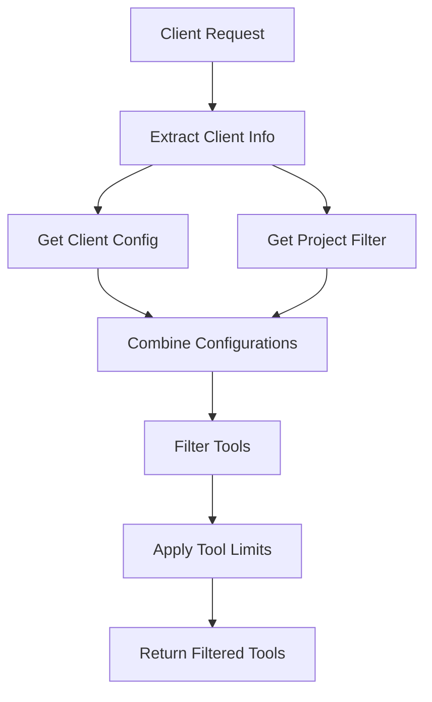

# BMAD Tool Management System

**Document version**: 1.0  
**Date**: 2025-01-09  
**Purpose**: Comprehensive documentation for BMAD WebMCP tool management system

## 🎯 **Overview**

The BMAD Tool Management System provides sophisticated tool filtering and exposure capabilities for the WebMCP server, enabling client-specific and project-specific tool access while maintaining legal compliance and optimal performance.

## 🏗️ **Architecture**

### **Core Components**

1. **ToolGroupManager**: Manages tool grouping and categorization
2. **ClientToolConfigManager**: Handles client-specific tool configurations
3. **ProjectToolFilterManager**: Manages project-specific tool filtering
4. **Enhanced WebMCP Server**: Integrates all components for dynamic tool exposure

### **System Flow**



## 📋 **Tool Groups**

### **Available Tool Groups**

| Group | Description | Required | Client Types | Project Types |
|-------|-------------|----------|--------------|---------------|
| **core** | Essential BMAD functionality | ✅ | cursor, mobile, web | greenfield, brownfield, game_dev, devops |
| **planning** | BMAD planning and orchestration | ❌ | cursor, web | greenfield, brownfield |
| **hil** | Human-in-the-Loop sessions | ❌ | mobile, web | greenfield, brownfield |
| **expansion** | BMAD expansion packs | ❌ | web | game_dev, devops, creative_writing |
| **development** | Development and code tools | ❌ | cursor, web | greenfield, brownfield |
| **research** | Research and documentation | ❌ | web | brownfield, research |
| **system** | System administration | ❌ | web | all |
| **git** | BMAD Git workflow tools | ❌ | cursor, web | greenfield, brownfield |
| **memory** | CerebralMemory integration | ❌ | web | all |
| **sandbox** | Sandbox execution environment | ❌ | cursor, web | greenfield, brownfield |
| **reasoning** | Code reasoning and planning | ❌ | cursor, web | greenfield, brownfield |

## 🔧 **Client Configurations**

### **Supported Client Types**

#### **Cursor IDE**
- **Max Tools**: 50
- **Enabled Groups**: core, planning, development, git, sandbox, reasoning
- **Disabled Tools**: desktop.notify, sys_debug, bmad_expansion_packs_*
- **Project Specific**: ✅
- **Legal Compliance**: ✅

#### **Mobile App**
- **Max Tools**: 30
- **Enabled Groups**: core, hil
- **Disabled Tools**: codegen.*, lint_*, test_*, sandbox.*, git.*
- **Project Specific**: ❌
- **Legal Compliance**: ✅

#### **Web Client**
- **Max Tools**: 100
- **Enabled Groups**: core, planning, hil, expansion, development, research, system, git, memory
- **Disabled Tools**: []
- **Project Specific**: ✅
- **Legal Compliance**: ❌

#### **IDE Integration**
- **Max Tools**: 75
- **Enabled Groups**: core, planning, development, git, sandbox, reasoning, memory
- **Disabled Tools**: desktop.notify
- **Project Specific**: ✅
- **Legal Compliance**: ✅

#### **CLI Interface**
- **Max Tools**: 40
- **Enabled Groups**: core, planning, git
- **Disabled Tools**: bmad_hil_*, desktop.notify, sandbox.*, enh_*
- **Project Specific**: ✅
- **Legal Compliance**: ✅

## 🎯 **Project Type Filtering**

### **Project Types**

| Project Type | Enabled Groups | Disabled Tools | Required Expansion Packs |
|--------------|----------------|----------------|-------------------------|
| **greenfield** | core, planning, development, git, sandbox, reasoning | bmad_brownfield_*, research, doc_research | [] |
| **brownfield** | core, planning, development, research, git, sandbox, reasoning | bmad_greenfield_* | technical_research |
| **game_dev** | core, planning, expansion, development, git | bmad_brownfield_*, research, doc_research | game_dev |
| **devops** | core, planning, expansion, development, git | bmad_brownfield_* | devops |
| **creative_writing** | core, planning, expansion, research | bmad_brownfield_*, codegen.*, lint_*, test_*, sandbox.* | creative_writing |
| **data_science** | core, planning, expansion, development, research | bmad_brownfield_* | data_science |
| **business_strategy** | core, planning, expansion, research | bmad_brownfield_*, codegen.*, lint_*, test_*, sandbox.* | business_strategy |
| **health_wellness** | core, planning, expansion, research | bmad_brownfield_*, codegen.*, lint_*, test_*, sandbox.* | health_wellness |
| **education** | core, planning, expansion, research | bmad_brownfield_*, codegen.*, lint_*, test_*, sandbox.* | education |
| **legal_assistant** | core, planning, expansion, research | bmad_brownfield_*, codegen.*, lint_*, test_*, sandbox.* | legal_assistant |
| **research** | core, planning, research, expansion | bmad_brownfield_*, codegen.*, lint_*, test_*, sandbox.* | technical_research |
| **infrastructure** | core, planning, expansion, development, git | bmad_brownfield_* | infrastructure |

## 🚀 **API Endpoints**

### **MCP Initialize**
```http
POST /mcp/initialize
Content-Type: application/json

{
  "clientInfo": {
    "client_type": "cursor",
    "project_type": "greenfield",
    "project_id": "my-project"
  }
}
```

**Response:**
```json
{
  "protocolVersion": "2024-11-05",
  "tools": [...],
  "client_config": {
    "client_type": "cursor",
    "project_type": "greenfield",
    "max_tools": 50,
    "enabled_groups": ["core", "planning", "development"],
    "project_specific": true,
    "tools_count": 45
  }
}
```

### **Filtered Tools**
```http
GET /mcp/tools/filtered?client_type=cursor&project_type=greenfield&project_id=my-project
```

**Response:**
```json
{
  "tools": [...],
  "count": 45,
  "client_type": "cursor",
  "project_type": "greenfield",
  "project_id": "my-project"
}
```

## 🔍 **Tool Filtering Logic**

### **Filtering Process**

1. **Client Configuration**: Get client-specific settings (max tools, enabled groups, disabled tools)
2. **Project Filter**: Get project-specific settings (enabled groups, disabled tools, expansion packs)
3. **Combine Configurations**: Intersect enabled groups, union disabled tools
4. **Apply Filters**: Filter tools based on combined configuration
5. **Enforce Limits**: Respect client tool limits
6. **Return Results**: Return filtered tool list

### **Wildcard Pattern Matching**

- **Disabled Tools**: Support wildcard patterns (e.g., `bmad_expansion_packs_*`)
- **Tool Groups**: Exact group membership matching
- **Client Types**: Exact client type matching
- **Project Types**: Exact project type matching

## 📊 **Tool Registry Metadata**

### **Tool Structure**
```json
{
  "name": "bmad_prd_create",
  "description": "Create Product Requirements Document",
  "inputSchema": {...},
  "group": "core",
  "metadata": {
    "group": "core",
    "required": true,
    "client_types": ["cursor", "mobile", "web"],
    "project_types": ["greenfield", "brownfield", "game_dev", "devops"]
  }
}
```

### **Validation Methods**

- **Tool Grouping Validation**: Ensure all tools are properly grouped
- **Client Configuration Validation**: Validate client-specific settings
- **Project Filter Validation**: Validate project-specific settings
- **Coverage Analysis**: Analyze tool coverage across groups

## 🛡️ **Security & Compliance**

### **Legal Compliance**

- **Client-Specific Filtering**: Disable tools based on client legal requirements
- **Project-Specific Filtering**: Filter tools based on project domain
- **Expansion Pack Control**: Manage expansion pack access per client/project
- **Audit Trail**: Log all tool filtering decisions

### **Access Control**

- **Tool Limits**: Enforce client-specific tool limits
- **Group Restrictions**: Restrict tool groups based on client capabilities
- **Project Validation**: Validate project type and requirements
- **Client Authentication**: Authenticate client requests

## 🔧 **Configuration Examples**

### **Cursor IDE Configuration**
```json
{
  "client_type": "cursor",
  "project_type": "greenfield",
  "project_id": "my-project",
  "enabled_groups": ["core", "planning", "development"],
  "max_tools": 50,
  "project_specific": true
}
```

### **Mobile App Configuration**
```json
{
  "client_type": "mobile",
  "project_type": "brownfield",
  "project_id": "legacy-project",
  "enabled_groups": ["core", "hil"],
  "max_tools": 30,
  "project_specific": false
}
```

### **Web Client Configuration**
```json
{
  "client_type": "web",
  "project_type": "game_dev",
  "project_id": "game-project",
  "enabled_groups": ["core", "planning", "expansion"],
  "max_tools": 100,
  "project_specific": true
}
```

## 📈 **Performance Considerations**

### **Optimization Strategies**

- **Tool Caching**: Cache filtered tool lists for common configurations
- **Lazy Loading**: Load tool groups on demand
- **Pattern Matching**: Optimize wildcard pattern matching
- **Memory Management**: Efficient tool registry management

### **Monitoring**

- **Tool Usage**: Track tool usage patterns
- **Filter Performance**: Monitor filtering performance
- **Client Behavior**: Analyze client tool preferences
- **Project Patterns**: Identify common project configurations

## 🧪 **Testing**

### **Test Scenarios**

1. **Client Type Testing**: Test all client configurations
2. **Project Type Testing**: Test all project type filters
3. **Combination Testing**: Test client + project combinations
4. **Edge Case Testing**: Test invalid configurations
5. **Performance Testing**: Test filtering performance
6. **Compliance Testing**: Test legal compliance filtering

### **Validation Tests**

- **Tool Grouping**: Validate all tools are properly grouped
- **Client Configs**: Validate all client configurations
- **Project Filters**: Validate all project filters
- **API Responses**: Validate API response formats
- **Error Handling**: Test error scenarios

## 🚀 **Deployment**

### **Configuration**

- **Environment Variables**: Configure via environment variables
- **Configuration Files**: Support configuration file overrides
- **Runtime Updates**: Support runtime configuration updates
- **Validation**: Validate configurations on startup

### **Monitoring**

- **Health Checks**: Monitor tool management system health
- **Metrics**: Track tool filtering metrics
- **Logging**: Comprehensive logging of filtering decisions
- **Alerting**: Alert on configuration issues

## 📚 **Usage Examples**

### **Basic Usage**

```python
from cflow_platform.core.tool_group_manager import ToolGroupManager
from cflow_platform.core.client_tool_config import ClientToolConfigManager
from cflow_platform.core.project_tool_filter import ProjectToolFilterManager

# Get tools for Cursor IDE working on greenfield project
client_config = ClientToolConfigManager.get_config_for_client("cursor")
project_filter = ProjectToolFilterManager.get_filter_for_project_type("greenfield")

# Filter tools
filtered_tools = filter_tools_for_client_and_project("cursor", "greenfield")
```

### **Advanced Usage**

```python
# Get tools by group
core_tools = ToolGroupManager.get_tools_for_group(ToolGroup.CORE)

# Get tools for specific client type
cursor_tools = ToolGroupManager.get_groups_for_client_type("cursor")

# Get tools for specific project type
greenfield_tools = ToolGroupManager.get_groups_for_project_type("greenfield")

# Validate tool grouping
validation = ToolGroupManager.validate_tool_grouping(tool_names)
```

## 🔮 **Future Enhancements**

### **Planned Features**

- **Dynamic Tool Loading**: Load tools dynamically based on usage
- **User Preferences**: Support user-specific tool preferences
- **Tool Recommendations**: Recommend tools based on project context
- **Advanced Filtering**: More sophisticated filtering options
- **Tool Analytics**: Advanced tool usage analytics
- **Custom Groups**: Support for custom tool groups
- **Tool Dependencies**: Handle tool dependencies and requirements

### **Integration Opportunities**

- **BMAD Expansion Packs**: Enhanced expansion pack integration
- **Client SDKs**: Client-specific SDKs with tool management
- **IDE Plugins**: Enhanced IDE plugin integration
- **Mobile Apps**: Enhanced mobile app integration
- **Web Dashboard**: Web-based tool management dashboard

---

This comprehensive tool management system ensures that BMAD tools are optimally exposed to different client types while maintaining legal compliance, performance, and user experience standards.
