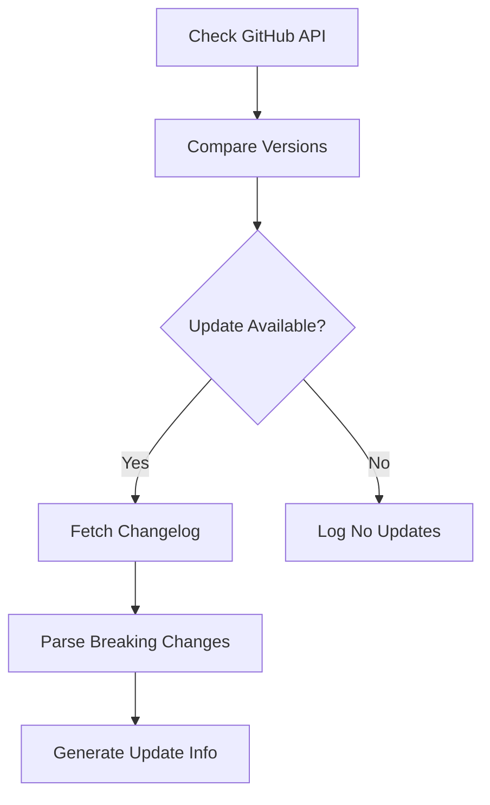
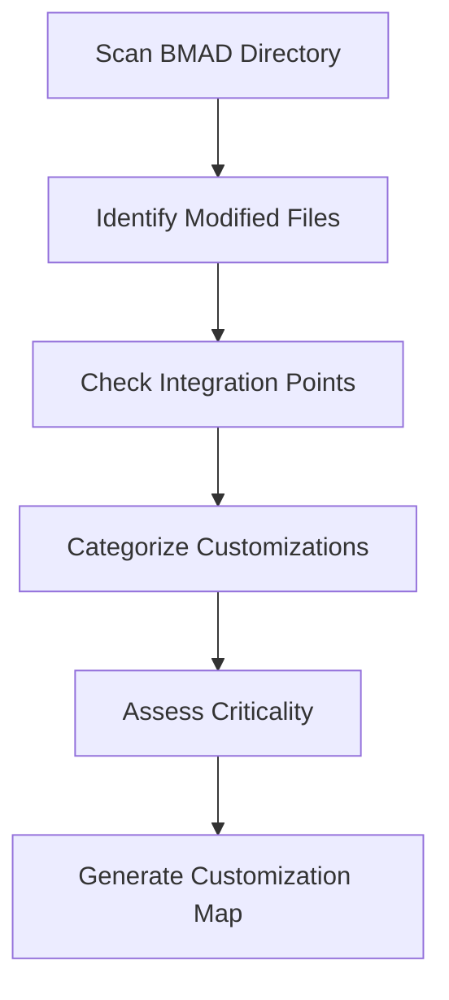
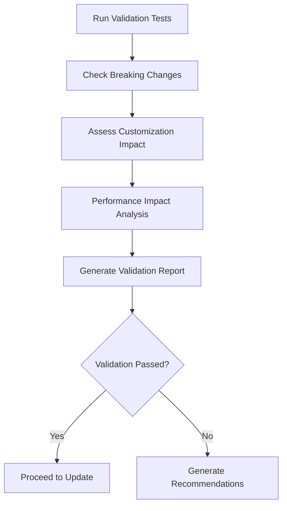
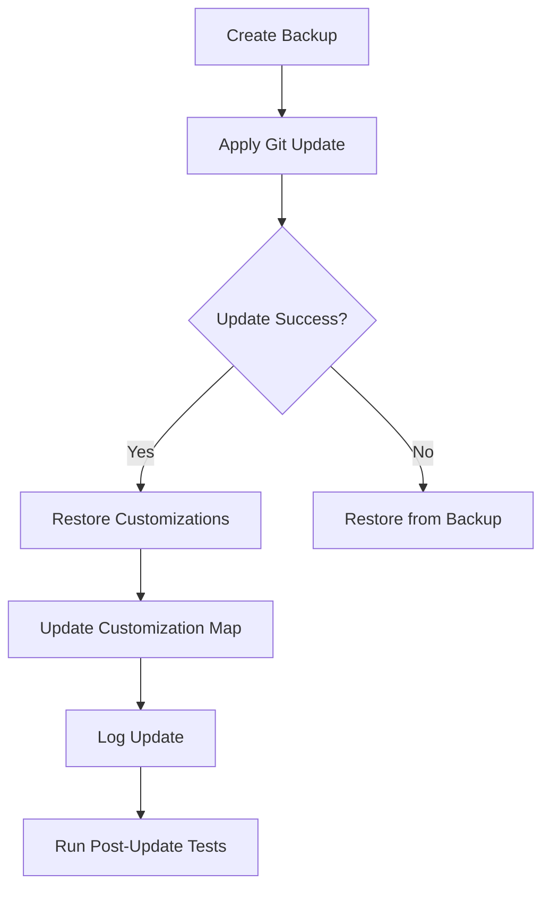

# BMAD Update Management System

**Document Version**: 1.0  
**Date**: 2025-01-17  
**Purpose**: Comprehensive update management for BMAD-method updates with customization preservation

## Overview

The BMAD Update Management System provides automated, safe, and intelligent updates for the BMAD-method integration in the Cerebral platform. It ensures that updates from the upstream BMAD repository are seamlessly integrated while preserving all customizations and maintaining platform stability.

## Key Features

### 🔄 **Automated Update Detection**
- **GitHub API Integration**: Monitors upstream BMAD repository for new releases
- **Version Comparison**: Compares current version with latest available
- **Changelog Analysis**: Automatically parses release notes for breaking changes, new features, and bug fixes
- **Dependency Tracking**: Monitors updates to dependencies and external packages

### 🛡️ **Customization Preservation**
- **Automatic Discovery**: Scans and catalogs all customizations in the BMAD vendor directory
- **Critical Customization Detection**: Identifies customizations critical for platform operation
- **Backup & Restore**: Creates comprehensive backups before updates and restores customizations after
- **Integration Point Mapping**: Tracks cflow-platform integration points with BMAD components

### ✅ **Comprehensive Validation**
- **Pre-Update Validation**: Validates updates before application to detect potential issues
- **Breaking Change Detection**: Identifies and reports breaking changes that may affect the platform
- **Integration Testing**: Runs comprehensive test suites to ensure compatibility
- **Performance Impact Assessment**: Evaluates potential performance impacts of updates

### 📊 **Intelligent Reporting**
- **Update Reports**: Generates detailed reports with recommendations and update plans
- **Customization Analysis**: Provides insights into affected customizations and required actions
- **Test Results**: Comprehensive test results with pass/fail status and recommendations
- **Performance Metrics**: Tracks performance impact and provides optimization suggestions

## Architecture

### Core Components

#### 1. BMADUpdateManager
The central orchestrator that manages the entire update lifecycle:

```python
class BMADUpdateManager:
    def __init__(self):
        self.bmad_root = Path("vendor/bmad")
        self.backup_root = Path(".bmad_backups")
        self.customizations_file = Path("bmad_customizations.json")
        self.github_api_base = "https://api.github.com/repos/bmadcode/BMAD-METHOD"
```

**Key Responsibilities**:
- Update detection and version management
- Customization discovery and cataloging
- Backup creation and restoration
- Update validation and application
- Integration testing and reporting

#### 2. CustomizationMapping
Data structure for tracking customizations:

```python
@dataclass
class CustomizationMapping:
    component: str  # bmad-core, expansion-packs, docs, tools
    file_path: str
    customization_type: str  # override, extension, integration, configuration
    description: str
    critical: bool  # Whether critical for platform operation
    backup_path: Optional[str] = None
    validation_tests: List[str] = None
```

#### 3. UpdateValidationResult
Comprehensive validation results:

```python
@dataclass
class UpdateValidationResult:
    success: bool
    errors: List[str]
    warnings: List[str]
    suggestions: List[str]
    breaking_changes: List[str]
    customizations_affected: List[str]
    test_results: Dict[str, bool]
    performance_impact: Optional[Dict[str, Any]] = None
```

### Integration Points

#### 1. GitHub API Integration
- **Authentication**: Uses GitHub token from Vault for API access
- **Release Monitoring**: Fetches latest release information and changelog
- **Version Comparison**: Compares semantic versions to determine update availability
- **Changelog Parsing**: Extracts breaking changes, features, and bug fixes

#### 2. Vault Integration
- **Secure Credentials**: Stores GitHub API tokens and other sensitive information
- **Configuration Management**: Manages update-related configuration settings
- **Access Control**: Ensures secure access to update management features

#### 3. Git Integration
- **Repository Management**: Handles git operations for BMAD vendor directory
- **Version Control**: Manages version tags and branch operations
- **Change Tracking**: Tracks modifications and customizations using git history

#### 4. Test Integration
- **Automated Testing**: Integrates with cflow-platform test suite
- **Validation Tests**: Runs specific tests for BMAD integration
- **Performance Testing**: Executes performance benchmarks and comparisons

## Update Workflow

### 1. Update Detection Phase



**Steps**:
1. **API Call**: Query GitHub API for latest release
2. **Version Comparison**: Compare current vs latest version
3. **Changelog Analysis**: Parse release notes for changes
4. **Categorization**: Categorize changes (breaking, features, fixes)

### 2. Customization Discovery Phase



**Steps**:
1. **File Scanning**: Recursively scan vendor/bmad directory
2. **Modification Detection**: Identify files with cflow-platform markers
3. **Integration Analysis**: Check cflow-platform files for BMAD references
4. **Categorization**: Group customizations by type and criticality

### 3. Validation Phase



**Steps**:
1. **Test Execution**: Run integration and validation tests
2. **Breaking Change Analysis**: Identify and assess breaking changes
3. **Customization Impact**: Determine which customizations will be affected
4. **Performance Assessment**: Evaluate potential performance impacts
5. **Report Generation**: Create comprehensive validation report

### 4. Update Application Phase



**Steps**:
1. **Backup Creation**: Create comprehensive backup of current state
2. **Git Update**: Apply update using git checkout
3. **Customization Restoration**: Restore critical customizations from backup
4. **Mapping Update**: Update customization mappings and metadata
5. **Logging**: Log update details for audit trail
6. **Validation**: Run post-update tests to verify functionality

## MCP Tools Integration

### Available Tools

#### Update Management Tools
- **`bmad_update_check`**: Check for available BMAD updates
- **`bmad_update_validate`**: Validate a BMAD update before applying
- **`bmad_update_apply`**: Apply a BMAD update with customization preservation
- **`bmad_update_report`**: Generate comprehensive update report

#### Customization Management Tools
- **`bmad_customizations_discover`**: Discover and catalog BMAD customizations
- **`bmad_customizations_backup`**: Backup current BMAD customizations
- **`bmad_customizations_restore`**: Restore BMAD customizations from backup

#### Testing Tools
- **`bmad_integration_test`**: Run integration tests to validate BMAD compatibility

### Usage Examples

#### Check for Updates
```python
# Check for available updates
result = await bmad_update_check()
print(f"Update available: {result['update_available']}")
print(f"Latest version: {result['latest_version']}")
```

#### Validate Update
```python
# Validate update before applying
result = await bmad_update_validate(target_version="2.1.0")
if result['can_proceed']:
    print("Update is safe to apply")
else:
    print(f"Update blocked: {result['errors']}")
```

#### Apply Update
```python
# Apply update with customization preservation
result = await bmad_update_apply(
    target_version="2.1.0",
    preserve_customizations=True
)
if result['status'] == 'success':
    print("Update applied successfully")
```

#### Generate Update Report
```python
# Generate comprehensive update report
result = await bmad_update_report(target_version="2.1.0")
print(f"Recommendations: {result['recommendations']}")
print(f"Update plan: {result['update_plan']}")
```

## Customization Types

### 1. Override Customizations
Files that completely replace BMAD functionality:
- **Example**: Custom workflow engine that replaces BMAD's default
- **Handling**: Full backup and restoration required
- **Risk Level**: High - may break with structural changes

### 2. Extension Customizations
Files that extend BMAD functionality:
- **Example**: Additional templates or workflows
- **Handling**: Selective backup and restoration
- **Risk Level**: Medium - may need updates for compatibility

### 3. Integration Customizations
Files that integrate BMAD with cflow-platform:
- **Example**: Configuration files with Cerebral-specific settings
- **Handling**: Critical - must be preserved
- **Risk Level**: High - platform functionality depends on these

### 4. Configuration Customizations
Configuration files modified for platform needs:
- **Example**: core-config.yaml with Cerebral-specific settings
- **Handling**: Full preservation required
- **Risk Level**: High - affects platform operation

## Error Handling & Recovery

### Backup Strategy
- **Pre-Update Backup**: Full directory backup before any update
- **Incremental Backups**: Customization-specific backups
- **Metadata Backup**: Customization mappings and configuration
- **Test Results Backup**: Validation and test results for rollback analysis

### Rollback Procedures
- **Automatic Rollback**: Triggered on update failure
- **Manual Rollback**: Available through MCP tools
- **Selective Rollback**: Restore specific customizations
- **Full System Rollback**: Complete restoration from backup

### Error Categories
1. **Validation Errors**: Failed tests or compatibility issues
2. **Update Errors**: Git operation failures or file conflicts
3. **Customization Errors**: Failed customization restoration
4. **Integration Errors**: Broken integration points

## Performance Considerations

### Update Performance
- **Parallel Processing**: Concurrent backup and validation operations
- **Incremental Updates**: Only update changed components
- **Caching**: Cache GitHub API responses and validation results
- **Resource Management**: Monitor disk space and memory usage

### Runtime Performance
- **Lazy Loading**: Load update manager components on demand
- **Background Processing**: Run updates in background when possible
- **Progress Tracking**: Provide real-time update progress
- **Resource Cleanup**: Clean up temporary files and backups

## Security Considerations

### Access Control
- **Vault Integration**: Secure storage of GitHub tokens and credentials
- **Permission Checks**: Verify update permissions before execution
- **Audit Logging**: Comprehensive logging of all update operations
- **Rollback Capability**: Secure rollback procedures for failed updates

### Data Protection
- **Backup Encryption**: Encrypt sensitive backup data
- **Secure Transmission**: Use HTTPS for all API communications
- **Access Logging**: Log all access to update management features
- **Data Retention**: Manage backup retention and cleanup

## Monitoring & Alerting

### Update Monitoring
- **Version Tracking**: Monitor current and available versions
- **Update Frequency**: Track update patterns and frequency
- **Success Rates**: Monitor update success and failure rates
- **Performance Impact**: Track performance before and after updates

### Alerting
- **Update Available**: Notify when new updates are available
- **Update Failures**: Alert on update failures or validation errors
- **Customization Conflicts**: Warn about potential customization conflicts
- **Performance Degradation**: Alert on significant performance impacts

## Best Practices

### Update Planning
1. **Regular Checks**: Schedule regular update checks (weekly/monthly)
2. **Staging Testing**: Test updates in staging environment first
3. **Gradual Rollout**: Apply updates gradually across environments
4. **Documentation**: Document all customizations and their purposes

### Customization Management
1. **Minimize Customizations**: Keep customizations to essential only
2. **Documentation**: Document all customizations and their purposes
3. **Testing**: Test customizations after each update
4. **Version Control**: Use version control for customization changes

### Risk Mitigation
1. **Backup Strategy**: Maintain comprehensive backup strategy
2. **Rollback Plans**: Have rollback plans ready for each update
3. **Monitoring**: Monitor system health after updates
4. **Communication**: Communicate updates and potential impacts to team

## Future Enhancements

### Planned Features
1. **Automated Testing**: Enhanced automated testing capabilities
2. **Performance Benchmarking**: Comprehensive performance comparison tools
3. **Customization Migration**: Automated customization migration tools
4. **Update Scheduling**: Scheduled update capabilities
5. **Multi-Environment Support**: Support for multiple deployment environments

### Integration Improvements
1. **CI/CD Integration**: Integration with CI/CD pipelines
2. **Notification Systems**: Enhanced notification and alerting systems
3. **Dashboard Integration**: Web dashboard for update management
4. **API Enhancements**: REST API for update management operations

## Conclusion

The BMAD Update Management System provides a robust, automated, and safe way to manage BMAD updates while preserving all customizations and maintaining platform stability. With comprehensive validation, backup, and rollback capabilities, it ensures that updates can be applied with confidence while minimizing risk and downtime.

The system is designed to be:
- **Automated**: Minimal manual intervention required
- **Safe**: Comprehensive validation and backup procedures
- **Intelligent**: Smart customization detection and preservation
- **Transparent**: Detailed reporting and logging
- **Recoverable**: Robust rollback and recovery procedures

This system ensures that the Cerebral platform can seamlessly benefit from upstream BMAD improvements while maintaining all customizations and integrations that make it unique.
