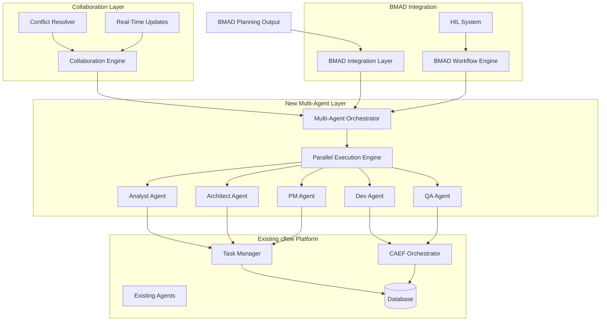
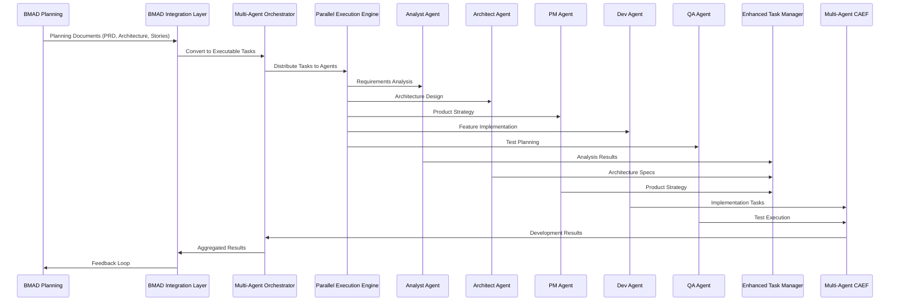
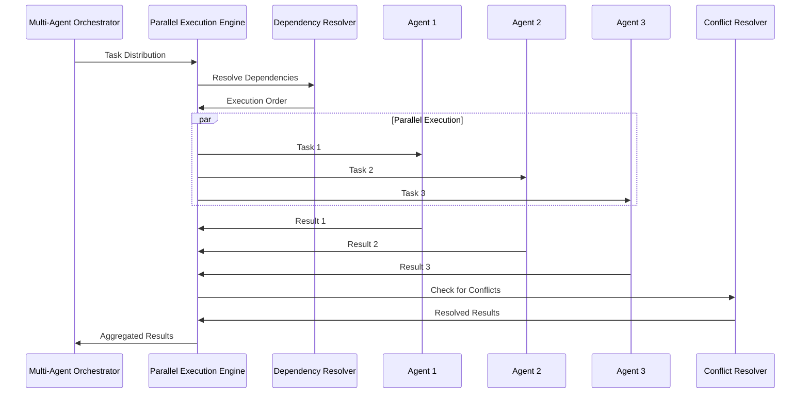

# Brownfield Multi-Agent Architecture Design

**Document Version**: 1.0  
**Date**: 2025-01-09  
**Type**: Architecture Design Document  
**Status**: Design Complete

## 🎯 **Architecture Overview**

This document outlines the architectural design for integrating BMAD multi-agent orchestration capabilities into the existing cflow platform. The design follows brownfield integration principles, enhancing existing systems without disrupting current functionality.

## 🏗️ **System Architecture**

### **High-Level Architecture**



### **Component Relationships**

1. **BMAD Integration Layer** - Processes BMAD output and converts to executable tasks
2. **Multi-Agent Orchestrator** - Coordinates multiple specialized agents
3. **Parallel Execution Engine** - Manages parallel task execution
4. **Specialized Agents** - BMAD-specific agent implementations
5. **Enhanced Task Manager** - Extended task management with multi-agent support
6. **Multi-Agent CAEF** - Enhanced CAEF with parallel agent execution
7. **Collaboration Engine** - Real-time multi-user collaboration
8. **BMAD Workflow Engine** - BMAD-specific workflow management

## 🔧 **Detailed Component Design**

### **1. Multi-Agent Orchestrator**

**Purpose**: Central coordination hub for multi-agent workflows

**Key Components**:
```python
class MultiAgentOrchestrator:
    """Core orchestration engine for multi-agent workflows"""
    
    def __init__(self):
        self.agent_registry = AgentRegistry()
        self.workflow_manager = WorkflowManager()
        self.coordination_engine = CoordinationEngine()
        self.execution_context = ExecutionContext()
    
    async def register_agent(self, agent_id: str, agent_config: Dict[str, Any]):
        """Register a specialized agent with capabilities"""
        
    async def start_workflow(self, workflow_id: str, context: Dict[str, Any]):
        """Start a multi-agent workflow"""
        
    async def coordinate_agents(self, task_distribution: Dict[str, List[str]]):
        """Coordinate parallel agent execution"""
        
    async def handle_agent_transitions(self, current_state: str, next_state: str):
        """Handle workflow state transitions between agents"""
```

**Architecture Patterns**:
- **Registry Pattern**: Centralized agent registration and discovery
- **Coordination Pattern**: Agent communication and synchronization
- **State Machine Pattern**: Workflow state management
- **Observer Pattern**: Event-driven coordination

### **2. Agent Specialization System**

**Purpose**: Implement BMAD-specific agent roles with specialized capabilities

**Agent Hierarchy**:
```python
class BMADAgent(ABC):
    """Base class for all BMAD specialized agents"""
    
    def __init__(self, agent_type: str, capabilities: List[str]):
        self.agent_type = agent_type
        self.capabilities = capabilities
        self.context = {}
        self.coordination_protocol = CoordinationProtocol()
    
    @abstractmethod
    async def execute_task(self, task: Dict[str, Any]) -> Dict[str, Any]:
        """Execute agent-specific task"""
        
    async def coordinate_with_peers(self, peer_agents: List[str]) -> Dict[str, Any]:
        """Coordinate with other agents in the workflow"""

class AnalystAgent(BMADAgent):
    """Business Analyst & Requirements Expert"""
    
    async def analyze_requirements(self, prd_content: str) -> Dict[str, Any]:
        """Analyze PRD and extract detailed requirements"""
        
    async def create_user_stories(self, requirements: Dict[str, Any]) -> Dict[str, Any]:
        """Create user stories from requirements analysis"""
        
    async def perform_stakeholder_analysis(self, stakeholders: List[str]) -> Dict[str, Any]:
        """Analyze stakeholder needs and priorities"""

class ArchitectAgent(BMADAgent):
    """Solution Architect & Technical Design Expert"""
    
    async def design_architecture(self, requirements: Dict[str, Any]) -> Dict[str, Any]:
        """Design technical architecture based on requirements"""
        
    async def create_technical_specs(self, architecture: Dict[str, Any]) -> Dict[str, Any]:
        """Create detailed technical specifications"""
        
    async def define_integration_patterns(self, systems: List[str]) -> Dict[str, Any]:
        """Define integration patterns between systems"""

class PMAgent(BMADAgent):
    """Product Manager & Strategy Expert"""
    
    async def create_product_strategy(self, market_analysis: Dict[str, Any]) -> Dict[str, Any]:
        """Create comprehensive product strategy"""
        
    async def prioritize_features(self, features: List[Dict[str, Any]]) -> Dict[str, Any]:
        """Prioritize features based on strategy and market needs"""
        
    async def create_roadmap(self, strategy: Dict[str, Any]) -> Dict[str, Any]:
        """Create product roadmap from strategy"""

class DevAgent(BMADAgent):
    """Software Developer & Implementation Expert"""
    
    async def implement_features(self, specifications: Dict[str, Any]) -> Dict[str, Any]:
        """Implement features based on technical specifications"""
        
    async def perform_code_review(self, code_changes: Dict[str, Any]) -> Dict[str, Any]:
        """Review code changes for quality and compliance"""
        
    async def create_technical_solutions(self, requirements: Dict[str, Any]) -> Dict[str, Any]:
        """Create technical solutions for requirements"""

class QAAgent(BMADAgent):
    """Quality Assurance & Testing Expert"""
    
    async def create_test_plans(self, specifications: Dict[str, Any]) -> Dict[str, Any]:
        """Create comprehensive test plans"""
        
    async def execute_tests(self, test_plans: Dict[str, Any]) -> Dict[str, Any]:
        """Execute tests and report results"""
        
    async def perform_quality_assurance(self, deliverables: Dict[str, Any]) -> Dict[str, Any]:
        """Perform quality assurance on deliverables"""
```

**Architecture Patterns**:
- **Strategy Pattern**: Different agent behaviors for different tasks
- **Template Method Pattern**: Common agent workflow with specialized steps
- **Command Pattern**: Task execution commands
- **Chain of Responsibility**: Task delegation and handling

### **3. Parallel Execution Engine**

**Purpose**: Manage parallel execution of multiple agent tasks

**Key Components**:
```python
class ParallelExecutionEngine:
    """Engine for parallel multi-agent execution"""
    
    def __init__(self):
        self.execution_pool = asyncio.Semaphore(10)  # Max parallel agents
        self.coordination_lock = asyncio.Lock()
        self.results_cache = {}
        self.dependency_resolver = TaskDependencyResolver()
    
    async def execute_parallel_tasks(self, tasks: List[Dict[str, Any]]) -> Dict[str, Any]:
        """Execute multiple tasks in parallel with coordination"""
        
    async def coordinate_dependencies(self, task_dependencies: Dict[str, List[str]]) -> Dict[str, Any]:
        """Handle task dependencies and coordination"""
        
    async def merge_results(self, results: List[Dict[str, Any]]) -> Dict[str, Any]:
        """Merge results from parallel execution"""

class TaskDependencyResolver:
    """Resolve and manage task dependencies"""
    
    async def resolve_dependencies(self, tasks: List[Dict[str, Any]]) -> List[Dict[str, Any]]:
        """Resolve task execution order based on dependencies"""
        
    async def detect_circular_dependencies(self, dependencies: Dict[str, List[str]]) -> bool:
        """Detect and prevent circular dependencies"""
        
    async def optimize_execution_order(self, tasks: List[Dict[str, Any]]) -> List[Dict[str, Any]]:
        """Optimize execution order for maximum parallelism"""
```

**Architecture Patterns**:
- **Pool Pattern**: Agent execution pool management
- **Dependency Injection**: Task dependency resolution
- **Observer Pattern**: Execution progress monitoring
- **Strategy Pattern**: Different execution strategies

### **4. BMAD Workflow Engine**

**Purpose**: Manage BMAD-specific workflow patterns and state transitions

**Key Components**:
```python
class BMADWorkflowEngine:
    """BMAD-specific workflow engine"""
    
    def __init__(self):
        self.workflow_definitions = {}
        self.active_workflows = {}
        self.state_machine = WorkflowStateMachine()
        self.hil_handler = HILHandler()
    
    async def load_bmad_workflow(self, workflow_id: str) -> Dict[str, Any]:
        """Load BMAD workflow definition"""
        
    async def execute_bmad_workflow(self, workflow_id: str, context: Dict[str, Any]) -> Dict[str, Any]:
        """Execute BMAD workflow with proper state transitions"""
        
    async def handle_hil_interactions(self, workflow_state: str, user_input: Dict[str, Any]) -> Dict[str, Any]:
        """Handle Human-in-the-Loop interactions"""

class WorkflowStateMachine:
    """State machine for BMAD workflows"""
    
    VALID_TRANSITIONS = {
        'prd_creation': ['architecture_creation', 'hil_session'],
        'architecture_creation': ['epic_creation', 'hil_session'],
        'epic_creation': ['story_creation'],
        'story_creation': ['development'],
        'development': ['testing', 'validation'],
        'testing': ['validation', 'development'],
        'validation': ['deployment', 'development']
    }
    
    async def transition(self, current_state: str, next_state: str, context: Dict[str, Any]) -> bool:
        """Validate and execute state transitions"""
        
    async def get_valid_transitions(self, current_state: str) -> List[str]:
        """Get valid next states for current state"""
```

**Architecture Patterns**:
- **State Machine Pattern**: Workflow state management
- **Command Pattern**: Workflow command execution
- **Observer Pattern**: State change notifications
- **Strategy Pattern**: Different workflow strategies

### **5. Enhanced Task Manager**

**Purpose**: Extend existing task manager with multi-agent capabilities

**Key Components**:
```python
class EnhancedTaskManager(LocalTaskManager):
    """Enhanced task manager with multi-agent support"""
    
    def __init__(self, db_path: Optional[Path] = None):
        super().__init__(db_path)
        self.agent_coordinator = AgentCoordinator()
        self.parallel_executor = ParallelExecutionEngine()
        self.dependency_manager = DependencyManager()
        self._ensure_enhanced_schema()
    
    def _ensure_enhanced_schema(self):
        """Add multi-agent schema extensions"""
        with sqlite3.connect(self.db_path) as conn:
            # Add agent assignment columns
            conn.execute("""
                ALTER TABLE tasks ADD COLUMN assigned_agent TEXT;
                ALTER TABLE tasks ADD COLUMN agent_capabilities JSONB;
                ALTER TABLE tasks ADD COLUMN execution_context JSONB;
                ALTER TABLE tasks ADD COLUMN dependencies JSONB;
                ALTER TABLE tasks ADD COLUMN parallel_execution BOOLEAN DEFAULT FALSE;
            """)
            conn.commit()
    
    async def assign_to_agent(self, task_id: str, agent_id: str, capabilities: List[str]) -> bool:
        """Assign task to specific agent"""
        
    async def execute_parallel_tasks(self, task_ids: List[str]) -> Dict[str, Any]:
        """Execute multiple tasks in parallel"""
        
    async def resolve_dependencies(self, task_id: str) -> List[str]:
        """Resolve task dependencies"""
```

**Architecture Patterns**:
- **Decorator Pattern**: Extends existing functionality
- **Adapter Pattern**: Adapts existing interface to new requirements
- **Facade Pattern**: Simplified interface for complex operations
- **Proxy Pattern**: Task execution proxy

### **6. Multi-Agent CAEF**

**Purpose**: Enhance CAEF with multi-agent parallel execution

**Key Components**:
```python
class MultiAgentCAEF:
    """Multi-agent version of CAEF orchestration"""
    
    def __init__(self):
        self.agent_pool = AgentPool()
        self.coordination_engine = CoordinationEngine()
        self.parallel_executor = ParallelExecutionEngine()
        self.phase_coordinator = PhaseCoordinator()
    
    async def run_multi_agent_iteration(self, 
                                       plan_fn: Callable[..., Dict[str, Any]],
                                       implement_fn: Callable[..., Dict[str, Any]],
                                       verify_fn: Callable[..., Dict[str, Any]],
                                       profile: Any,
                                       agent_assignment: Dict[str, str]) -> Dict[str, Any]:
        """Run CAEF iteration with multiple agents"""
        
    async def coordinate_planning_agents(self, planning_context: Dict[str, Any]) -> Dict[str, Any]:
        """Coordinate multiple agents for planning phase"""
        
    async def coordinate_implementation_agents(self, implementation_context: Dict[str, Any]) -> Dict[str, Any]:
        """Coordinate multiple agents for implementation phase"""
        
    async def coordinate_verification_agents(self, verification_context: Dict[str, Any]) -> Dict[str, Any]:
        """Coordinate multiple agents for verification phase"""

class AgentPool:
    """Pool of available agents for task assignment"""
    
    def __init__(self):
        self.available_agents = {}
        self.busy_agents = {}
        self.agent_capabilities = {}
        self.assignment_strategies = AssignmentStrategies()
    
    async def assign_agent(self, task_requirements: Dict[str, Any]) -> Optional[str]:
        """Assign best available agent for task"""
        
    async def release_agent(self, agent_id: str) -> None:
        """Release agent back to pool"""
        
    async def get_agent_status(self) -> Dict[str, Any]:
        """Get status of all agents in pool"""
```

**Architecture Patterns**:
- **Pool Pattern**: Agent pool management
- **Strategy Pattern**: Different assignment strategies
- **Observer Pattern**: Agent status monitoring
- **Command Pattern**: Agent command execution

### **7. Collaboration Engine**

**Purpose**: Enable real-time multi-user collaboration

**Key Components**:
```python
class CollaborationEngine:
    """Real-time collaboration engine for multi-user workflows"""
    
    def __init__(self):
        self.active_sessions = {}
        self.user_presence = {}
        self.conflict_resolver = ConflictResolver()
        self.realtime_updater = RealtimeUpdater()
    
    async def start_collaboration_session(self, session_id: str, users: List[str]) -> Dict[str, Any]:
        """Start collaborative session"""
        
    async def handle_user_input(self, session_id: str, user_id: str, input_data: Dict[str, Any]) -> Dict[str, Any]:
        """Handle user input in collaborative session"""
        
    async def resolve_conflicts(self, conflicts: List[Dict[str, Any]]) -> Dict[str, Any]:
        """Resolve conflicts in collaborative editing"""
        
    async def broadcast_updates(self, session_id: str, updates: Dict[str, Any]) -> None:
        """Broadcast updates to all session participants"""

class ConflictResolver:
    """Resolve conflicts in collaborative workflows"""
    
    async def detect_conflicts(self, changes: List[Dict[str, Any]]) -> List[Dict[str, Any]]:
        """Detect conflicts between user changes"""
        
    async def resolve_conflicts(self, conflicts: List[Dict[str, Any]]) -> Dict[str, Any]:
        """Resolve conflicts automatically when possible"""
        
    async def escalate_conflicts(self, unresolved_conflicts: List[Dict[str, Any]]) -> Dict[str, Any]:
        """Escalate unresolved conflicts to human resolution"""
```

**Architecture Patterns**:
- **Observer Pattern**: Real-time update notifications
- **Mediator Pattern**: Conflict resolution mediation
- **Strategy Pattern**: Different conflict resolution strategies
- **Command Pattern**: User input command handling

## 🔄 **Data Flow Architecture**

### **BMAD Integration Flow**



### **Parallel Execution Flow**



## 🗄️ **Database Schema Design**

### **Enhanced Schema Extensions**

```sql
-- Multi-agent orchestration tables
CREATE TABLE agent_registry (
    agent_id UUID PRIMARY KEY DEFAULT uuid_generate_v4(),
    agent_type TEXT NOT NULL,
    capabilities JSONB NOT NULL,
    status TEXT DEFAULT 'active' CHECK (status IN ('active', 'busy', 'offline')),
    created_at TIMESTAMPTZ DEFAULT NOW(),
    updated_at TIMESTAMPTZ DEFAULT NOW()
);

CREATE TABLE workflow_executions (
    execution_id UUID PRIMARY KEY DEFAULT uuid_generate_v4(),
    workflow_id TEXT NOT NULL,
    status TEXT DEFAULT 'running' CHECK (status IN ('running', 'paused', 'completed', 'failed')),
    current_stage TEXT,
    context JSONB,
    started_at TIMESTAMPTZ DEFAULT NOW(),
    completed_at TIMESTAMPTZ,
    created_by UUID REFERENCES users(id)
);

CREATE TABLE agent_tasks (
    task_id UUID PRIMARY KEY DEFAULT uuid_generate_v4(),
    execution_id UUID REFERENCES workflow_executions(execution_id),
    agent_id UUID REFERENCES agent_registry(agent_id),
    task_type TEXT NOT NULL,
    status TEXT DEFAULT 'pending' CHECK (status IN ('pending', 'running', 'completed', 'failed')),
    dependencies JSONB DEFAULT '[]'::jsonb,
    result JSONB,
    created_at TIMESTAMPTZ DEFAULT NOW(),
    updated_at TIMESTAMPTZ DEFAULT NOW()
);

-- Enhanced tasks table extensions
ALTER TABLE tasks ADD COLUMN assigned_agent TEXT;
ALTER TABLE tasks ADD COLUMN agent_capabilities JSONB;
ALTER TABLE tasks ADD COLUMN execution_context JSONB;
ALTER TABLE tasks ADD COLUMN dependencies JSONB;
ALTER TABLE tasks ADD COLUMN parallel_execution BOOLEAN DEFAULT FALSE;

-- Collaboration tables
CREATE TABLE collaboration_sessions (
    session_id UUID PRIMARY KEY DEFAULT uuid_generate_v4(),
    workflow_execution_id UUID REFERENCES workflow_executions(execution_id),
    status TEXT DEFAULT 'active' CHECK (status IN ('active', 'paused', 'completed')),
    participants JSONB NOT NULL,
    created_at TIMESTAMPTZ DEFAULT NOW(),
    updated_at TIMESTAMPTZ DEFAULT NOW()
);

CREATE TABLE user_presence (
    user_id UUID REFERENCES users(id),
    session_id UUID REFERENCES collaboration_sessions(session_id),
    status TEXT DEFAULT 'online' CHECK (status IN ('online', 'away', 'offline')),
    last_seen TIMESTAMPTZ DEFAULT NOW(),
    PRIMARY KEY (user_id, session_id)
);

-- Indexes for performance
CREATE INDEX idx_agent_tasks_execution_id ON agent_tasks(execution_id);
CREATE INDEX idx_agent_tasks_agent_id ON agent_tasks(agent_id);
CREATE INDEX idx_agent_tasks_status ON agent_tasks(status);
CREATE INDEX idx_workflow_executions_status ON workflow_executions(status);
CREATE INDEX idx_tasks_assigned_agent ON tasks(assigned_agent);
CREATE INDEX idx_tasks_parallel_execution ON tasks(parallel_execution);
```

## 🔒 **Security Architecture**

### **Authentication & Authorization**

```python
class MultiAgentSecurityManager:
    """Security manager for multi-agent system"""
    
    def __init__(self):
        self.auth_provider = AuthenticationProvider()
        self.authorization_engine = AuthorizationEngine()
        self.audit_logger = AuditLogger()
    
    async def authenticate_agent(self, agent_id: str, credentials: Dict[str, Any]) -> bool:
        """Authenticate agent access"""
        
    async def authorize_agent_action(self, agent_id: str, action: str, resource: str) -> bool:
        """Authorize agent action on resource"""
        
    async def audit_agent_action(self, agent_id: str, action: str, resource: str, result: Dict[str, Any]):
        """Audit agent action for compliance"""
```

### **Data Protection**

- **Encryption**: All agent communication encrypted
- **Access Control**: Role-based access control for agents
- **Audit Logging**: Comprehensive audit trail
- **Data Isolation**: Tenant isolation for multi-user scenarios

## 📊 **Performance Architecture**

### **Scalability Design**

```python
class ScalabilityManager:
    """Manage system scalability and performance"""
    
    def __init__(self):
        self.load_balancer = LoadBalancer()
        self.cache_manager = CacheManager()
        self.performance_monitor = PerformanceMonitor()
    
    async def balance_agent_load(self, agents: List[str]) -> Dict[str, int]:
        """Balance load across available agents"""
        
    async def optimize_execution(self, tasks: List[Dict[str, Any]]) -> List[Dict[str, Any]]:
        """Optimize task execution for performance"""
        
    async def monitor_performance(self) -> Dict[str, Any]:
        """Monitor system performance metrics"""
```

### **Performance Targets**

- **Parallel Execution**: 3-5x faster than sequential
- **Agent Coordination**: <100ms overhead
- **Workflow Transitions**: <50ms state changes
- **Real-time Updates**: <200ms latency
- **System Throughput**: 1000+ tasks/minute

## 🔧 **Deployment Architecture**

### **Container Architecture**

```yaml
# docker-compose.yml
version: '3.8'
services:
  multi-agent-orchestrator:
    image: cflow-platform/multi-agent-orchestrator:latest
    environment:
      - DATABASE_URL=${DATABASE_URL}
      - REDIS_URL=${REDIS_URL}
    depends_on:
      - postgres
      - redis
  
  agent-analyst:
    image: cflow-platform/agent-analyst:latest
    environment:
      - ORCHESTRATOR_URL=http://multi-agent-orchestrator:8000
  
  agent-architect:
    image: cflow-platform/agent-architect:latest
    environment:
      - ORCHESTRATOR_URL=http://multi-agent-orchestrator:8000
  
  agent-pm:
    image: cflow-platform/agent-pm:latest
    environment:
      - ORCHESTRATOR_URL=http://multi-agent-orchestrator:8000
  
  agent-dev:
    image: cflow-platform/agent-dev:latest
    environment:
      - ORCHESTRATOR_URL=http://multi-agent-orchestrator:8000
  
  agent-qa:
    image: cflow-platform/agent-qa:latest
    environment:
      - ORCHESTRATOR_URL=http://multi-agent-orchestrator:8000
  
  postgres:
    image: postgres:15
    environment:
      - POSTGRES_DB=cflow_platform
      - POSTGRES_USER=cflow
      - POSTGRES_PASSWORD=${POSTGRES_PASSWORD}
  
  redis:
    image: redis:7
```

### **Kubernetes Deployment**

```yaml
# k8s-deployment.yaml
apiVersion: apps/v1
kind: Deployment
metadata:
  name: multi-agent-orchestrator
spec:
  replicas: 3
  selector:
    matchLabels:
      app: multi-agent-orchestrator
  template:
    metadata:
      labels:
        app: multi-agent-orchestrator
    spec:
      containers:
      - name: orchestrator
        image: cflow-platform/multi-agent-orchestrator:latest
        ports:
        - containerPort: 8000
        env:
        - name: DATABASE_URL
          valueFrom:
            secretKeyRef:
              name: cflow-secrets
              key: database-url
---
apiVersion: v1
kind: Service
metadata:
  name: multi-agent-orchestrator
spec:
  selector:
    app: multi-agent-orchestrator
  ports:
  - port: 8000
    targetPort: 8000
  type: LoadBalancer
```

## 🎭 **Conclusion**

This architecture design provides a comprehensive blueprint for integrating BMAD multi-agent orchestration capabilities into the existing cflow platform. The design follows brownfield integration principles, ensuring existing functionality is preserved while adding powerful new capabilities.

**Key Architectural Benefits**:
- ✅ **Modular Design** - Components can be developed and deployed independently
- ✅ **Scalable Architecture** - Supports horizontal scaling and load balancing
- ✅ **Fault Tolerant** - Built-in failure recovery and resilience
- ✅ **Secure** - Comprehensive security and audit capabilities
- ✅ **Performant** - Optimized for high-performance parallel execution
- ✅ **Maintainable** - Clean separation of concerns and clear interfaces

**Next Steps**:
1. Review and approve architecture design
2. Begin implementation of core components
3. Set up development and testing environments
4. Start Phase 1 development

The architecture is designed to support the full BMAD integration roadmap while maintaining the reliability and performance of the existing cflow platform.
