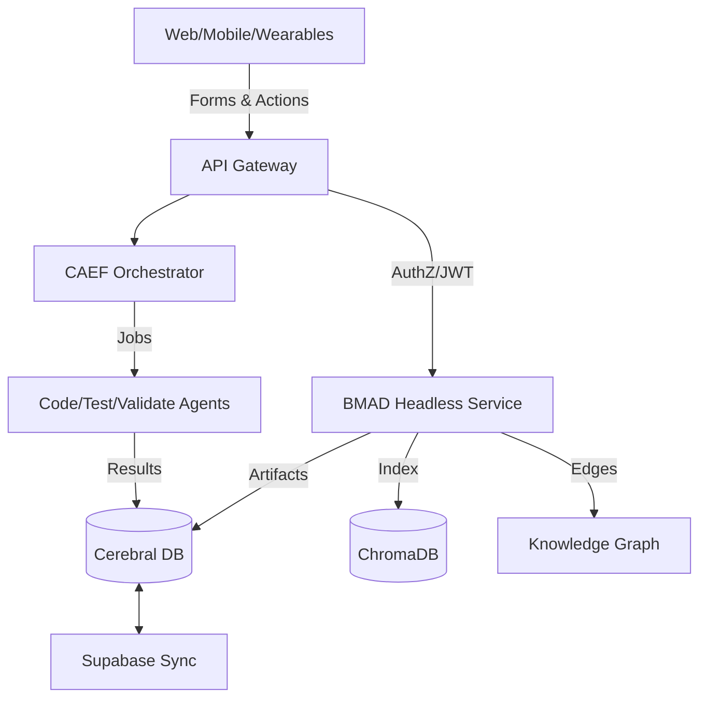

# BMAD Core Platform Integration Plan

Document version: 1.0  
Date: 2025-09-14  
Owner: Cerebral Platform Architecture

Summary
- Make BMAD-METHOD (MIT) the authoritative planning/PM/story core of the Cerebral platform.  
- Keep CAEF as the orchestrator for multi-agent code/test/validation after planning gates.  
- Use hosted LLM APIs for agent reasoning (BMAD agents). Keep Ollama/Apple Silicon only for embeddings (RAG/KG) to avoid contention and simplify agent runtime.  
- Replace BMAD’s web UI with Cerebral Web/mobile/wearable UIs; no IDE requirement.  
- Vendor BMAD into our stack with proper attribution; expose as headless services with strict security, tenancy, and compliance.

Links
- BMAD-METHOD (MIT): https://github.com/bmadcode/BMAD-METHOD

---

## I. Base Project Description (PRD)

### 1) Problem & Goals
- Problem: Planning inconsistency and context loss reduce code quality and increase rework. Existing flows allow codegen to start before PRD/Architecture/Story are sufficiently complete.
- Goal: Adopt BMAD’s agentic planning and context-engineered development as the mandatory planning/PM/story system, enforce gates before codegen, and integrate artifacts into Cerebral’s RAG/KG and PM.

### 2) Scope
- In scope: BMAD planning agents (Analyst/PM/Architect/SM/Dev/QA), PRD/Architecture/Story lifecycle, CAEF-gated code/test/validation, storage and RAG/KG indexing, web/mobile/wearable UX, security/tenancy/audit, 1‑touch installer integration, local runner + IDE tools optional.
- Out of scope: Retaining BMAD’s web UI; legacy TaskMaster file/json systems; non-compliant mock systems.

### 3) Success Criteria (VEG & AEMI)
- VEG: Code and services must be production-ready, zero placeholders/TODOs, testable, validated under performance SLOs, with acceptance tests and clear interfaces.
- AEMI: Atomic tasks with micro-validations and gates; documentation-first plan; gated transitions; audited orchestration; no elaborate theater; real integrations only.

### 4) Technical Stack
- Services:  
  - BMAD core (Node v20, headless) vendored into `vendor/bmad/` and exposed via internal HTTP/MCP endpoints.  
  - CAEF Orchestrator (Python) controls gated execution.  
  - RAG/KG: ChromaDB primary (local), Supabase sync (prod), Knowledge Graph builder.  
  - API Gateway/Ingress, Service Mesh (istio/linkerd if applicable).  
  - Secrets: Vault.  
  - Storage: Postgres (Supabase), Object storage (MinIO/S3) for artifacts, ChromaDB for vectors.
- Clients: Cerebral Web (React), mobile/wearables (native) using platform APIs.

### 5) High‑Level Architecture

### 6) Database Schema Design (mapping)
- Documents: `cerebral_documents` (doc_id, tenant_id, project_id, type: PRD|ARCH|STORY, versioning, status, content, authored_by, artifacts)
- Tasks: `cerebral_tasks` (task_id, tenant_id, project_id, derived_from_story, status, priority, dependencies, metadata)
- Activities/Audit: `cerebral_activities` (actor, action, resource, timestamp, metadata)
- RAG: `agentic_knowledge_chunks` + vectors tables; link docs↔chunks↔tasks; maintain 1024D code embeddings; allow 384D for docs where configured.

### 7) Code Style & Compliance
- Python/TypeScript standards; typing enforced; linting required; pre-commit hooks.  
- SOC2/GDPR/HIPAA alignment (audits, PII detection/redaction, data retention/deletion flows).

---

## II. Process Outline (Agentic Workflow)

### 1) Agentic Workflow Definition (Gated)
1. PRD authored via Cerebral Web (BMAD planning agents).  
2. Architecture derived/approved.  
3. Story generated with full context (implementation instructions).  
4. Gate: Planning Complete → CAEF allowed to orchestrate code/test/validation.  
5. Parallel execution (CAEF): coding agents, test agents, validation agents.  
6. Continuous RAG/KG updates; artifacts/audits persisted; metrics and cost tracked.

### 2) Prompt Definitions & Templates
- Centralized prompt library for PRD, Architecture, Story; per-tenant policy for provider/model; include context, constraints, acceptance criteria.

### 3) Tools (runtime)
- Web search (research mode), code analysis, repo introspection, CAEF job control, RAG/KG indexing, Supabase/ChromaDB sync.

### 4) Context Management
- Ingest all artifacts (PRD/Architecture/Story) into RAG; codebase vectors updated via hooks; KG links across requirements↔stories↔tasks↔commits.

### 5) Feedback Loops & Reflection
- Test results and validation feed back into Story revisions before re-run; versioned artifacts; audit every cycle.

### 6) Logging & Observability
- OTel tracing for agent calls; job metrics (latency, cost, tokens); queue depth; SLO dashboards; alerting.

### 7) Test Strategy (VEG)
- Unit/integration tests for services; contract tests for BMAD API facade; end-to-end gates; performance targets (<200ms API p95 where applicable, async jobs measured separately).

---

## III. Recommended Formats
- Markdown for developer-facing docs; YAML/JSON for config/workflows; mermaid diagrams for architecture.

---

## Security & Compliance Plan
- Identity/Access: tenant isolation; role-based gates for approvals; device-bound sessions for wearables.  
- Secrets: Vault-managed; no plaintext secrets in env/files; rotation policies.  
- Data governance: PII & secret scanning on artifacts before persistence; redaction in logs; encryption at rest/in transit; data retention/deletion workflows (GDPR).  
- Egress: allowlist LLM endpoints; per-tenant quotas and budgets; egress proxy with DLP.  
- Audits: append-only activity log; SIEM export; incident runbooks.

## Scalability Plan (10Ks users)
- Stateless BMAD APIs behind HPA; worker pools for long jobs; queues (Redis/Cloud MQ) with retry/backoff/idempotency.  
- Separate pools for planning vs. RAG/KG vs. CAEF execution to prevent contention.  
- Vector DB: partition/shard by tenant; snapshot/backup/restore drills.  
- Provider router: rate limits, burst queues, circuit breakers, multi-region.

## Centralized AutoDoc Integration (Server Cluster)
- Authoritative processing for embeddings, chunking, and KG updates will run on the server cluster. Local `.cerebraflow` remains an optional cache/offline preview; the cluster reconciles on push.
- Ingestion Triggers:
  - Git: replace local post-commit heavy jobs with a webhook to the cluster (commit metadata, changed files).  
  - API: POST `/rag/index` to schedule indexing for PRD/Architecture/Story and code changes.  
  - Schedules: CRON jobs for backfills, drift detection, and snapshotting.
- Workers & Queues:
  - Dedicated RAG/KG worker pool with idempotent jobs, retry/backoff, and dead-letter queues.  
  - Server-side Apple Silicon/Ollama used strictly for embeddings where available; agents remain hosted LLM APIs.
- Storage:
  - ChromaDB primary in-cluster; Supabase sync downstream; artifacts in MinIO/S3; strict tenant partitioning.  
  - File and model locks (ChromaDBWriteLock, FileLock) enforced in workers to prevent contention.
- Security & Audit:
  - Vault-injected provider keys; SOC2/GDPR/HIPAA logging for all jobs; PII/secret scanning pre-index.
- Migration Path:
  - Phase out local-only vectorization in git hooks → emit webhook to cluster; cluster performs canonical indexing and KG linking.

## GPU Acceleration Strategy (Cluster)
- Use cluster GPUs for all vectorization and GPU-beneficial jobs (embeddings, rerankers, summarization pipelines used in AutoDoc/KG), not local developer GPUs.
- Scheduling & Runtime:
  - Request `nvidia.com/gpu` resources for GPU-enabled workers; use nodeSelectors/taints to target GPU nodes.  
  - Install NVIDIA Device Plugin via `cerebral-deployment` and enable GPU metrics collection.  
  - Build GPU container images with CUDA 12.x and cuBLAS/cuDNN for PyTorch/SentenceTransformers; provide a CPU fallback image.  
  - Set device selection logic: prefer `cuda` → `mps` (if Apple nodes present in future) → `cpu`, with explicit environment toggles.
- Portability & Testing:
  - The existing Apple Silicon accelerator was designed to be GPU-agnostic; add validation on NVIDIA GPUs and document ROCm considerations.  
  - Benchmark throughput/latency vs CPU; choose chunk sizes/batch sizes accordingly.  
  - Provide feature flags to disable GPU per-tenant or per-namespace if needed.
- Security & Compliance:
  - Image provenance (signed), SBOM, and pinned SHAs; GPU node isolation policies and NetworkPolicies.  
  - Cost and utilization dashboards with budgets/alerts.

## Installer Integration (1‑Touch)
- Kubernetes manifests: Deployment/Service/Ingress, HPA, PDB, PSP/PodSecurity, NetworkPolicy.  
- Vault templates for provider keys; image SHAs only.  
- API gateway routes; WebMCP tool registration; background workers; CRON jobs for maintenance.  
- DB migrations for new tables/columns; backfill scripts.

### AutoDoc Installer Items
- Deploy `rag-indexer` workers and queues; NetworkPolicy for outbound provider calls.  
- Register webhook route (`/webhooks/git-commit`) in API gateway.  
- Configure MinIO/S3 buckets for artifacts and model caches; set HF/TOKENIZER safe envs.

## API Contracts (minimal)
- POST `/bmad/planning/prd` (create/update PRD)  
- POST `/bmad/planning/architecture`  
- POST `/bmad/planning/story`  
- POST `/bmad/gates/approve` → emits CAEF token  
- POST `/caef/jobs/start`  
- GET `/sync/changes?cursor=…` / POST `/sync/upsert`  
- POST `/rag/index`

### AutoDoc/RAG Webhooks
- POST `/webhooks/git-commit`  
  - Body: commit hash, branch, author, changed file list (optional diff summary).  
  - Action: enqueue RAG/KG indexing job; respond 202 with job id.

## Local Runner & IDE
- `cflow-local bmad *` CLI with login, provider setup, artifact upsert, sync.  
- MCP tools for IDEs; toggle “use local provider” vs. server routing; always sync to platform.

## Migration & Cleanup (Decommission/Archive)
1. Inventory abandoned systems (TaskMaster remnants, legacy UIs, mock services, duplicated validation code).  
2. Create a git tag `pre-bmad-core` and archive these directories/files under `docs/historical-reports/` or `docs/_archive/` with justification.  
3. Replace entrypoints with BMAD/CAEF equivalents; remove JSON/file-based task systems; delete forbidden mock paths.  
4. Update CI/CD and hooks to call BMAD/CAEF flows only.  
5. Verify no direct Supabase task connections (DB-first via RAG/CAEF only).  
6. Post-clean validation: lints, tests, scanning, security checks.

Deprecated Categories (examples)
- Legacy TaskMaster CLI/configs; JSON task files.  
- Non-compliant mock/placeholder implementations; duplicated validators to be consolidated.  
- Any STDIO-based MCP tools where WebMCP is mandated.

## Risks & Mitigations
- Upstream BMAD drift → vendor branch, monthly sync, contract tests.  
- Cost spikes → quotas, budgets, model selection policies, caching.  
- Multi-tenant leakage → strict RLS, audit, automated tests.  
- Long jobs blocking → queue/isolation, backpressure, max concurrency.

## Timeline (Indicative)
- Week 1: Vendor BMAD, API facade, DB schema, base deploy via 1‑touch.  
- Week 2: Provider router, queues/workers, CAEF gate, RAG/KG wiring, Vault integration.  
- Week 3: Web flows, audits/metrics, mobile endpoints, load tests.  
- Week 4: Compliance validation, quotas/budgets, canary rollout.

## Acceptance Criteria (AEMI/VEG)
- Planning → code gates enforced; Story required before CAEF execution.  
- All artifacts persisted and indexed; KG links established.  
- Security: Vault-only secrets; RLS enforced; audits complete.  
- Scale: HPA autoscaling verified; queue SLOs met; backup/restore tested.  
- Quality: All tests green; e2e run shows improved cycle quality; dashboards live.

## Rollback Plan
- Feature flag to disable BMAD service; revert to pre-bmad-core tag; data migrations reversible; zero-downtime rollback.

---

Appendix A: Provider Policy
- Agents use hosted LLM APIs with per-tenant quotas.  
- Embeddings (RAG/KG) remain on Ollama/Apple Silicon (local cluster) for cost control.

Appendix B: Compliance Mapping
- SOC2: change management, logical access, system monitoring—mapped to CAEF + audit services.  
- GDPR: right to erasure/export; data minimization.  
- HIPAA: PHI segregation, access logs; encryption; BAAs where applicable.

