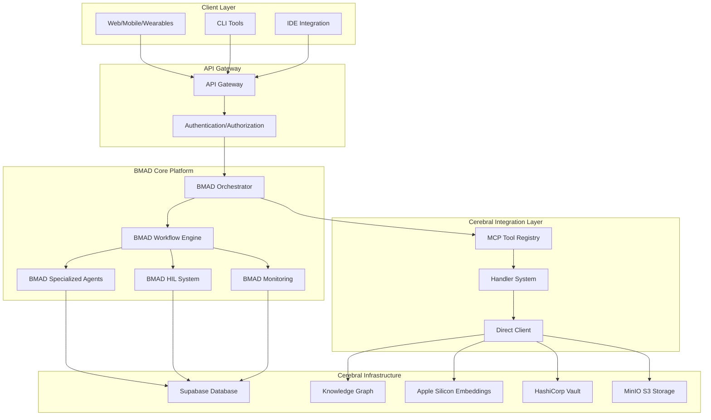
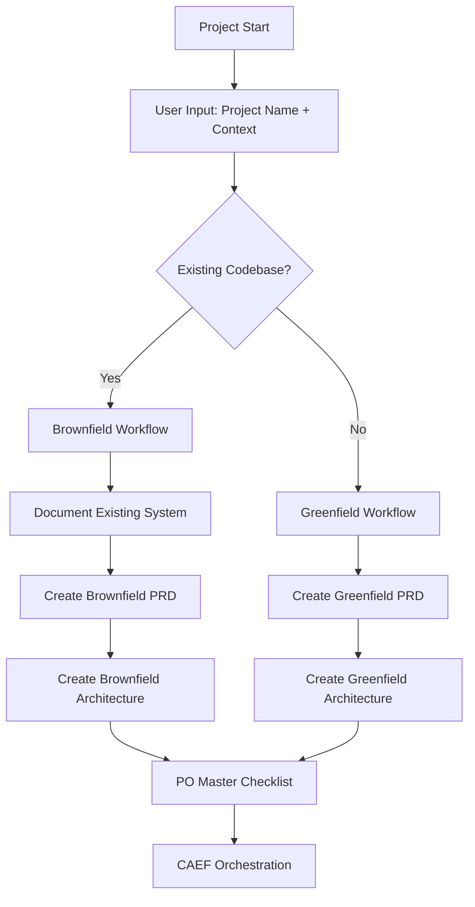
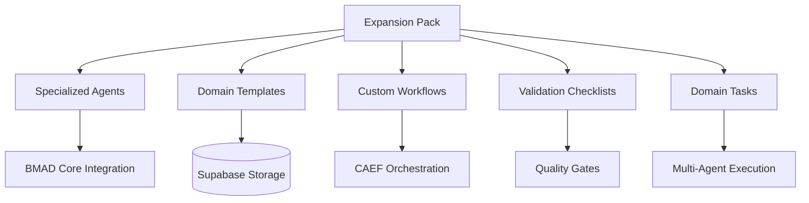
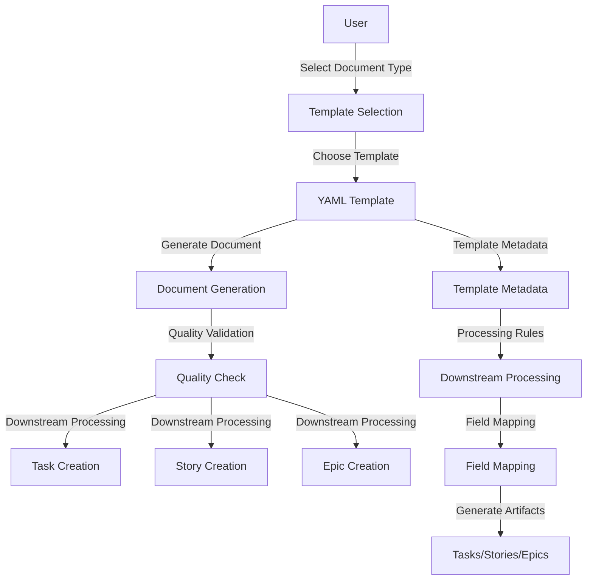

# BMAD Core Platform Integration Plan

Document version: 2.0  
Date: 2025-09-18  
Owner: Cerebral Platform Architecture

Summary
- **STRATEGIC REVISION**: Replace CAEF entirely with BMAD as the complete multi-agent orchestration platform.
- **CORE-FIRST APPROACH**: Focus on core BMAD-Cerebral integration and infrastructure before advanced features.
- **HYBRID ARCHITECTURE**: Keep cflow-platform as Cerebral integration layer, replace CAEF with BMAD workflow engine.
- **MULTI-AGENT FOUNDATION**: Build multi-agent parallel system as testing foundation for remaining features.
- **PHASED IMPLEMENTATION**: Core Integration → Infrastructure → Multi-Agent System → Testing → Advanced Features.

Links
- BMAD-METHOD (MIT): https://github.com/bmadcode/BMAD-METHOD

---

## I. Base Project Description (PRD)

### 1) Problem & Goals
- **Problem**: CAEF's single-agent sequential execution limits scalability and sophistication. Planning inconsistency and context loss reduce code quality and increase rework.
- **Goal**: Replace CAEF entirely with BMAD's sophisticated multi-agent orchestration platform, providing complete workflow management, HIL integration, and parallel execution capabilities.

### 2) Scope
- **In scope**: 
  - **Phase 1**: Core BMAD-Cerebral integration (workflow engine, database schema, basic agents)
  - **Phase 2**: Infrastructure components (HashiCorp Vault, expansion pack storage, memory migration)
  - **Phase 3**: Multi-agent parallel system (orchestration, parallel execution, testing framework)
  - **Phase 4**: Testing & validation (end-to-end testing, performance validation, integration testing)
  - **Phase 5**: Advanced features (expansion packs, HIL, brownfield/greenfield workflows)
- **Out of scope**: CAEF components (orchestrator, agent_loop, generic agents), BMAD's web UI, legacy TaskMaster systems.

### 3) Success Criteria (VEG & AEMI)
- VEG: Code and services must be production-ready, zero placeholders/TODOs, testable, validated under performance SLOs, with acceptance tests and clear interfaces.
- AEMI: Atomic tasks with micro-validations and gates; documentation-first plan; gated transitions; audited orchestration; no elaborate theater; real integrations only.

### 4) Technical Stack
- **Core Platform**: 
  - **BMAD Workflow Engine**: Complete multi-agent orchestration replacing CAEF
  - **BMAD Specialized Agents**: Analyst, PM, Architect, SM, Dev, QA with domain expertise
  - **BMAD HIL System**: Interactive sessions, elicitation, approval workflows
  - **BMAD Monitoring**: Workflow status, progress tracking, artifact management
- **Cerebral Integration Layer** (cflow-platform):
  - **Supabase Integration**: Multi-user database, knowledge graph, embeddings
  - **Apple Silicon Accelerator**: Optimized MPS embeddings for local development
  - **MCP Tool Registry**: Centralized tool definitions and handler system
  - **Code Intelligence**: Function indexing, vectorization, enterprise search
- **Infrastructure**:
  - **HashiCorp Vault**: Centralized secret management
  - **MinIO S3**: Object storage for artifacts and expansion packs
  - **Postgres (Supabase)**: Database with pgvector for embeddings
  - **WebMCP Server**: Runs on cerebral cluster, imports tools from cflow-platform
- **Clients**: Cerebral Web (React Native + React Native Web), mobile/wearables (React Native)

### 5) Phased Implementation Strategy

#### **Phase 1: Core BMAD-Cerebral Integration** (Weeks 1-4)
**Goal**: Establish foundational BMAD workflow engine integration with Cerebral infrastructure

**Key Components**:
- ✅ **BMAD Workflow Engine**: Replace CAEF orchestrator with BMAD workflow management
- ✅ **Database Schema**: Extend Supabase schema for BMAD documents, workflows, HIL sessions
- ✅ **Basic Agent Integration**: Core BMAD agents (Analyst, PM, Architect, SM, Dev, QA)
- ✅ **MCP Tool Registry**: BMAD tool definitions and handler integration
- ✅ **Direct Client**: BMAD tool execution via cflow-platform handlers

**Success Criteria**:
- BMAD workflow engine operational in Cerebral cluster
- Basic PRD → Architecture → Story workflow functional
- Database schema supports BMAD document lifecycle
- MCP tools accessible via cflow-platform

#### **Phase 2: Infrastructure Components** (Weeks 5-8)
**Goal**: Complete infrastructure migration and multi-user cluster readiness

**Key Components**:
- ✅ **HashiCorp Vault Integration**: Centralized secret management
- ✅ **Expansion Pack Storage**: Database/S3 storage for BMAD expansion packs
- ✅ **Memory Migration**: Move from local JSONL to Supabase memory_items table
- ✅ **RAG Document Storage**: Database/S3 storage for generated documents
- ✅ **Multi-User Testing**: Validate cluster accessibility and performance

**Success Criteria**:
- All secrets managed via HashiCorp Vault
- Expansion packs accessible across cluster nodes
- Memory system supports multi-user access
- Performance meets multi-user SLOs

#### **Phase 3: Multi-Agent Parallel System** (Weeks 9-12)
**Goal**: Build sophisticated multi-agent orchestration as testing foundation

**Key Components**:
- ✅ **BMAD Orchestrator**: Multi-agent coordination and state management
- ✅ **Parallel Execution Engine**: Simultaneous agent execution capabilities
- ✅ **Agent Specialization System**: Domain-specific agent roles and capabilities
- ✅ **Workflow State Management**: Complex workflow transitions and artifact tracking
- ✅ **Integration Testing**: End-to-end workflow validation

**Success Criteria**:
- Multi-agent parallel execution operational
- Workflow state transitions working correctly
- Agent specialization functioning properly
- Integration tests passing consistently

#### **Phase 4: Testing & Validation Framework** (Weeks 13-16)
**Goal**: Comprehensive testing framework using multi-agent system as foundation

**Key Components**:
- ✅ **End-to-End Testing**: Complete workflow testing from PRD to deployment
- ✅ **Performance Validation**: Multi-agent system performance under load
- ✅ **Integration Testing**: Cross-component integration validation
- ✅ **User Acceptance Testing**: Real-world scenario validation
- ✅ **Monitoring & Observability**: Production-ready monitoring and alerting

**Success Criteria**:
- All workflows tested end-to-end
- Performance meets production SLOs
- Monitoring provides actionable insights
- System ready for production deployment

#### **Phase 5: Advanced Features & Expansion Packs** (Weeks 17-20)
**Goal**: Complete advanced features using proven multi-agent foundation

**Key Components**:
- ✅ **BMAD Expansion Packs**: Domain-specific capabilities (Game Dev, DevOps, etc.)
- ✅ **HIL Integration**: Interactive sessions and approval workflows
- ✅ **Brownfield/Greenfield Workflows**: Project type detection and routing
- ✅ **Advanced Monitoring**: Sophisticated workflow analytics and insights
- ✅ **Production Deployment**: Full production rollout with monitoring

**Success Criteria**:
- Expansion packs integrated and functional
- HIL system providing interactive capabilities
- Brownfield/greenfield workflows operational
- Production deployment successful with monitoring

#### **Phase 6: Final Cleanup & 100% Completion Validation** (Weeks 21-22)
**Goal**: Complete cleanup, validation, and ensure 100% project completion

**Key Components**:
- ✅ **Final Code Cleanup**: Remove all CAEF references, unused code, dead imports
- ✅ **100% Completion Validation**: Comprehensive functionality, performance, security validation
- ✅ **Production Deployment**: Deploy to production cerebral cluster with monitoring
- ✅ **Final Documentation**: Complete project documentation and deployment runbook
- ✅ **Git Workflow**: Final commit and push of all changes to GitHub

**Success Criteria**:
- All CAEF components completely removed
- 100% functionality validation complete
- Production deployment operational
- Complete documentation and runbooks available
- All changes committed and pushed to GitHub

### 6) High‑Level Architecture


### 7) Database Schema Design (BMAD-Cerebral Integration)
- **BMAD Documents**: `cerebral_documents` (id, tenant_id, project_id, kind: PRD|ARCH|STORY|EPIC, status, content, authored_by, created_at, updated_at)
- **BMAD Workflows**: `bmad_workflows` (id, tenant_id, project_id, workflow_type, status, current_step, artifacts, created_at, updated_at)
- **BMAD HIL Sessions**: `bmad_hil_sessions` (id, doc_id, doc_type, session_type, status, questions_asked, responses_received, document_sections, created_at, updated_at)
- **BMAD Expansion Packs**: `bmad_expansion_packs` (id, tenant_id, pack_name, version, status, agents, templates, workflows, metadata)
- **Project Expansion Packs**: `project_expansion_packs` (project_id, expansion_pack_id, enabled, configuration)
- **Memory Items**: `memory_items` (id, tenant_id, title, content, metadata, created_at, updated_at)
- **Knowledge Items**: `knowledge_items` (id, tenant_id, title, content, metadata, created_at, updated_at)
- **Knowledge Embeddings**: `knowledge_embeddings` (id, knowledge_item_id, tenant_id, content_chunk, embedding, chunk_index, content_type, metadata)
- **Activities/Audit**: `cerebral_activities` (actor, action, resource, timestamp, metadata)

### 8) Code Style & Compliance
- Python/TypeScript standards; typing enforced; linting required; pre-commit hooks.  
- SOC2/GDPR/HIPAA alignment (audits, PII detection/redaction, data retention/deletion flows).

---

## II. BMAD Human-in-the-Loop (HIL) Approval System

### 2.1 Interactive Document Creation

**Interactive PRD Creation**:
- **Fast Track Mode**: When project brief is available, create PRD directly
- **Interactive Mode**: When more human input is needed, engage in Q&A sessions
- **Q&A Topics**: User personas, functional requirements, non-functional requirements, success metrics, risks and assumptions
- **Human Validation**: Required approval before proceeding to Architecture creation

**Interactive Architecture Creation**:
- **Prerequisite Check**: PRD must be approved before Architecture creation
- **Q&A Topics**: Architectural patterns, data persistence, security requirements, deployment strategy, integration patterns
- **Human Validation**: Required approval before proceeding to Epic creation

**Interactive Story Creation**:
- **Prerequisite Check**: Architecture must be approved before Story creation
- **Human Approval**: Required approval before development begins
- **Status Management**: Stories must be marked as "Approved" before development

### 2.2 Approval Gate System

**Document Approval Workflow**:
- **PRD Approval**: Required before Architecture creation
- **Architecture Approval**: Required before Epic creation
- **Story Approval**: Required before development begins
- **Development Approval**: Required before QA review
- **Final Approval**: Required before marking stories as done

**Approval Process**:
- **Approval Request**: System requests human approval for documents
- **Human Review**: Human reviews document and provides feedback
- **Approval Decision**: Human approves or requests revisions
- **Status Update**: Document status updated based on approval decision
- **Workflow Continuation**: Next steps enabled only after approval

### 2.3 Interactive Session Management

**Session Types**:
- **PRD Interactive Session**: Q&A between PM agent and human
- **Architecture Interactive Session**: Q&A between Architect agent and human
- **Story Review Session**: Human review and approval of stories

**Session Management**:
- **Session Creation**: Start interactive session with specific agent
- **Question Progression**: Sequential Q&A with agent
- **Human Response**: Human provides answers and feedback
- **Agent Feedback**: Agent processes responses and asks follow-up questions
- **Session Completion**: Finalize session and generate approved document

### 2.4 Workflow Gate Enforcement

**Gate Enforcement Rules**:
- **PRD Gate**: Cannot create Architecture without approved PRD
- **Architecture Gate**: Cannot create Epics without approved Architecture
- **Story Gate**: Cannot begin development without approved Stories
- **Development Gate**: Cannot proceed to QA without development approval
- **Completion Gate**: Cannot mark stories as done without final approval

**Gate Status Tracking**:
- **Current Gate**: Track which approval gate is currently active
- **Gate Requirements**: Define what approvals are required for each gate
- **Gate Status**: Track approval status for each gate
- **Next Action**: Determine next action based on gate status

## III. BMAD Brownfield vs Greenfield Integration

### 1) Project Type Detection Overview
The Cerebral platform must automatically detect and route between greenfield (new projects) and brownfield (existing system enhancement) workflows. This is critical because most real-world software development involves enhancing existing systems rather than building from scratch.

### 2) Project Type Detection Logic


### 3) Brownfield Workflow Components

#### 3.1) Project Documentation Phase
- **Purpose**: Generate comprehensive documentation from existing codebase
- **Agent**: Architect with `document-project` task
- **Output**: Complete system documentation stored in `cerebral_documents`
- **Integration**: Automatically indexed in Knowledge Graph for RAG search

#### 3.2) Enhancement Planning Phase
- **Purpose**: Create PRD focused on enhancement with existing system analysis
- **Agent**: PM with `brownfield-prd-tmpl.yaml`
- **Features**: 
  - Existing system analysis
  - Integration point identification
  - Compatibility requirements
  - Risk assessment
  - Migration strategy

#### 3.3) Architecture Planning Phase
- **Purpose**: Create architecture with integration strategy
- **Agent**: Architect with `brownfield-architecture-tmpl.yaml`
- **Features**:
  - Integration strategy design
  - Migration approach planning
  - Backwards compatibility
  - Risk mitigation strategies
  - Performance impact analysis

#### 3.4) Validation Phase
- **Purpose**: Ensure compatibility and no breaking changes
- **Agent**: PO with enhanced master checklist
- **Features**:
  - Project type-specific validation
  - Integration safety checks
  - Risk mitigation verification
  - Compliance validation

### 4) Greenfield Workflow Components

#### 4.1) Requirements Planning Phase
- **Purpose**: Create PRD for new project from scratch
- **Agent**: PM with `prd-tmpl.yaml`
- **Features**: Standard BMAD greenfield planning

#### 4.2) Architecture Planning Phase
- **Purpose**: Create architecture for new system
- **Agent**: Architect with `architecture-tmpl.yaml`
- **Features**: Standard BMAD greenfield architecture

#### 4.3) Validation Phase
- **Purpose**: Ensure completeness and quality
- **Agent**: PO with standard master checklist
- **Features**: Standard BMAD greenfield validation

### 5) Unified Workflow Integration

#### 5.1) Entry Points
- **Web/Mobile/Wearable UIs**: Project creation forms with project type detection
- **IDE Integration**: Automatic project type detection from existing codebase
- **CLI Tools**: Explicit project type specification with validation

#### 5.2) Server Platform Components
- **Project Type Detector**: Core service for automatic detection
- **Workflow Router**: Routes to appropriate greenfield/brownfield workflow
- **Template Manager**: Manages greenfield vs brownfield templates
- **Documentation Generator**: Handles existing system documentation

#### 5.3) Database Schema Extensions
```sql
-- Project type tracking
ALTER TABLE cerebral_documents ADD COLUMN project_type TEXT CHECK (project_type IN ('greenfield', 'brownfield'));
ALTER TABLE cerebral_tasks ADD COLUMN project_type TEXT CHECK (project_type IN ('greenfield', 'brownfield'));

-- Brownfield-specific metadata
ALTER TABLE cerebral_documents ADD COLUMN existing_system_analysis JSONB;
ALTER TABLE cerebral_documents ADD COLUMN integration_strategy JSONB;
ALTER TABLE cerebral_documents ADD COLUMN migration_plan JSONB;
```

### 6) API Endpoints for Project Type Management

#### 6.1) Project Type Detection
- `POST /bmad/project-type/detect` - Detect project type from context
- `GET /bmad/project-type/{project_id}` - Get project type for existing project

#### 6.2) Brownfield-Specific Endpoints
- `POST /bmad/brownfield/document-project` - Generate project documentation
- `POST /bmad/brownfield/prd-create` - Create brownfield PRD
- `POST /bmad/brownfield/arch-create` - Create brownfield architecture
- `POST /bmad/brownfield/story-create` - Create brownfield story

#### 6.3) Greenfield-Specific Endpoints
- `POST /bmad/greenfield/prd-create` - Create greenfield PRD
- `POST /bmad/greenfield/arch-create` - Create greenfield architecture
- `POST /bmad/greenfield/story-create` - Create greenfield story

### 7) Client Integration Requirements

#### 7.1) Web/Mobile/Wearable UIs
- Project creation forms with project type selection
- Context input fields for existing system information
- Workflow-specific UI components for greenfield vs brownfield

#### 7.2) IDE Integration
- Automatic project type detection from file system
- Context-aware agent suggestions
- Workflow-specific tool palettes

#### 7.3) CLI Tools
- Project type specification flags
- Context input parameters
- Workflow-specific command options

---

## III. BMAD Expansion Packs Integration

### 1) Expansion Pack Overview
BMAD expansion packs extend the core framework beyond traditional software development, providing specialized agent teams, templates, and workflows for specific domains. Each pack is a self-contained ecosystem designed to bring AI-assisted workflows to any field.

### 2) Available Expansion Packs
- **Game Development**: 2D Phaser, 2D Unity, Godot game development with specialized agents
- **Creative Writing**: Complete writing team with plot architects, character psychologists, editors
- **Infrastructure/DevOps**: Cloud architecture, platform engineering, CI/CD automation
- **Data Science**: ML model development, data engineering, visualization
- **Business Strategy**: Market analysis, financial planning, operations optimization
- **Health & Wellness**: Fitness training, nutrition planning, habit building
- **Education**: Curriculum design, instructional design, assessment
- **Legal Assistant**: Contract analysis, legal research, compliance checking

### 3) Expansion Pack Architecture


### 4) Cerebral Cluster Integration
- **Pack Registry**: Centralized registry of available expansion packs
- **Dynamic Loading**: Packs loaded on-demand based on project requirements
- **Agent Routing**: Specialized agents routed through BMAD HTTP API facade
- **Template Storage**: Domain-specific templates stored in Supabase
- **Workflow Integration**: Custom workflows integrated with CAEF orchestration

### 5) Expansion Pack Database Schema
```sql
-- Expansion Pack Registry
CREATE TABLE bmad_expansion_packs (
  pack_id uuid PRIMARY KEY DEFAULT gen_random_uuid(),
  tenant_id uuid NOT NULL,
  pack_name text NOT NULL,
  version text NOT NULL,
  status text NOT NULL CHECK (status IN ('available', 'installed', 'active', 'deprecated')),
  description text,
  agents jsonb, -- List of specialized agents
  templates jsonb, -- Available templates
  workflows jsonb, -- Custom workflows
  metadata jsonb,
  created_at timestamptz NOT NULL DEFAULT now(),
  updated_at timestamptz NOT NULL DEFAULT now()
);

-- Project Pack Associations
CREATE TABLE project_expansion_packs (
  project_id uuid NOT NULL,
  pack_id uuid REFERENCES bmad_expansion_packs(pack_id),
  status text NOT NULL CHECK (status IN ('enabled', 'disabled')),
  configuration jsonb,
  PRIMARY KEY (project_id, pack_id)
);
```

### 6) Expansion Pack API Endpoints
- `POST /bmad/expansion-packs/install` - Install expansion pack
- `GET /bmad/expansion-packs/list` - List available packs
- `POST /bmad/expansion-packs/enable` - Enable pack for project
- `GET /bmad/expansion-packs/{pack_id}/agents` - Get pack agents
- `POST /bmad/expansion-packs/{pack_id}/execute` - Execute pack workflow

---

## III. BMAD Technical Research Expansion Pack Integration

### 1) Technical Research Expansion Pack Overview
The BMAD Technical Research expansion pack replaces Enhanced Research infrastructure with a unified, template-based system for technical research and documentation generation. This expansion pack provides comprehensive AI-powered technical research capabilities while maintaining multi-user cluster compatibility.

### 2) Key Features
- **6 Specialized Research Agents**: Code Analyst, Vector Researcher, Documentation Specialist, Knowledge Graph Navigator, Task Research Coordinator, Technical Writer
- **YAML Template-Based Document Generation**: Standardized templates for TDD, API docs, user guides, specs, README, architecture, deployment, troubleshooting, changelog
- **Template Selection Process**: Users choose from numbered lists of available templates with rich customization
- **Downstream Processing**: Automatic task/story/epic creation from documents using standardized templates
- **Multi-User Cluster Ready**: Built for cluster environment from day one with database storage

### 3) Template System Architecture


### 4) Available Templates
- **TDD Template**: Test-Driven Development document with comprehensive test scenarios and implementation plans
- **API Documentation Template**: REST API documentation with endpoints, data models, error handling, examples
- **User Guide Template**: End-user documentation with getting started guides and feature documentation
- **Technical Specification Template**: Technical requirements and design specifications
- **README Template**: Project overview and setup instructions
- **Architecture Document Template**: System architecture documentation
- **Deployment Guide Template**: Deployment and infrastructure documentation
- **Troubleshooting Guide Template**: Common issues and solutions
- **Changelog Template**: Version history and changes

### 5) Integration Benefits
- **Eliminates Enhanced Research Issues**: No multi-user problems, no monorepo dependencies, no local file storage
- **Superior Integration**: Seamless flow from research to development through BMAD workflow
- **Template-Based Standardization**: Consistent document structure with downstream processing compatibility
- **Rich Customization**: Flexible templates while maintaining standards
- **Quality Assurance**: Built-in validation and quality checks

---

## IV. Multi-User Cluster Compatibility Fixes

### 1) Critical Single-User Issues Identified
Based on comprehensive audit of all BMAD components, several critical single-user issues were identified that must be fixed before development:

#### 1.1 High Priority Fixes (Must Fix Before Development)
- **BMAD Expansion Pack Storage**: Currently stored in local `vendor/bmad/expansion-packs/` directory
- **Memory Storage**: Local JSONL file storage in `.cerebraflow/memory_items.jsonl`
- **RAG Document Generation**: TDD documents stored in local `.cerebraflow/docs/tdds/` directory
- **Secret Storage**: Secrets stored in local `.cerebraflow/secrets.json` file

#### 1.2 Medium Priority Fixes
- **Plan Parser Integration**: Loads from local monorepo path
- **Enhanced Research Integration**: Falls back to local monorepo implementation

### 2) Multi-User Cluster Fixes Implementation

#### 2.1 HashiCorp Vault Integration
- **Purpose**: Replace local secret storage with centralized, cluster-accessible secret management
- **Benefits**: 
  - Centralized secret management with encryption and access control
  - Cluster-wide access to secrets via API
  - Audit trails and access controls
  - Dynamic secret rotation capabilities
- **Implementation**: Replace `SecretStore` with Vault client, migrate existing secrets to Vault

#### 2.2 BMAD Expansion Pack Storage Fix
- **Purpose**: Move expansion packs from local file system to database/S3 storage
- **Implementation**: 
  - Create `bmad_expansion_packs` table for metadata
  - Store pack content in S3 buckets
  - Update expansion pack handlers for database access

#### 2.3 Memory Storage Fix
- **Purpose**: Replace local JSONL with Supabase storage
- **Implementation**: 
  - Use existing `memory_items` table
  - Remove local file system dependency
  - Update memory handlers for database access

#### 2.4 RAG Document Storage Fix
- **Purpose**: Store TDD documents in database instead of local files
- **Implementation**: 
  - Create database schema for TDD documents
  - Use S3 for large document content
  - Remove local file system dependency

#### 2.5 Enhanced Research Deprecation
- **Purpose**: Replace Enhanced Research with BMAD Technical Research expansion pack
- **Implementation**: 
  - Deprecate Enhanced Research handlers
  - Migrate existing functionality to BMAD agents
  - Update client integrations to use BMAD expansion pack

### 3) Database Schema Extensions for Multi-User Support
```sql
-- Expansion Pack Storage
CREATE TABLE bmad_expansion_packs (
  pack_id uuid PRIMARY KEY DEFAULT gen_random_uuid(),
  tenant_id uuid NOT NULL,
  pack_name text NOT NULL,
  version text NOT NULL,
  status text NOT NULL CHECK (status IN ('available', 'installed', 'active', 'deprecated')),
  description text,
  agents jsonb,
  templates jsonb,
  workflows jsonb,
  metadata jsonb,
  created_at timestamptz NOT NULL DEFAULT now(),
  updated_at timestamptz NOT NULL DEFAULT now()
);

-- Project Pack Associations
CREATE TABLE project_expansion_packs (
  project_id uuid NOT NULL,
  pack_id uuid REFERENCES bmad_expansion_packs(pack_id),
  status text NOT NULL CHECK (status IN ('enabled', 'disabled')),
  configuration jsonb,
  PRIMARY KEY (project_id, pack_id)
);

-- TDD Document Storage
CREATE TABLE tdd_documents (
  id uuid PRIMARY KEY DEFAULT gen_random_uuid(),
  tenant_id uuid NOT NULL,
  project_id uuid NOT NULL,
  task_id uuid,
  title text NOT NULL,
  content text NOT NULL,
  template_used text NOT NULL,
  quality_score numeric,
  status text DEFAULT 'draft',
  created_at timestamptz NOT NULL DEFAULT now(),
  updated_at timestamptz NOT NULL DEFAULT now()
);

-- Object Storage References
CREATE TABLE object_storage_refs (
  id uuid PRIMARY KEY DEFAULT gen_random_uuid(),
  document_id uuid REFERENCES tdd_documents(id) ON DELETE CASCADE,
  storage_type text NOT NULL,
  bucket_name text NOT NULL,
  object_key text NOT NULL,
  object_size integer,
  content_type text,
  storage_metadata jsonb,
  created_at timestamptz NOT NULL DEFAULT now()
);
```

### 4) Compliance Matrix
| Component | Multi-User Ready | Database Storage | Cluster Accessible | Priority |
|-----------|------------------|------------------|-------------------|----------|
| BMAD Documents | ✅ | ✅ | ✅ | ✅ Complete |
| BMAD Workflows | ✅ | ✅ | ✅ | ✅ Complete |
| BMAD Expansion Enablement | ✅ | ✅ | ✅ | ✅ Complete |
| BMAD Expansion Storage | ❌ | ❌ | ❌ | 🔴 High |
| Memory Storage | ❌ | ❌ | ❌ | 🔴 High |
| RAG Documents | ❌ | ❌ | ❌ | 🔴 High |
| Secret Storage | ❌ | ❌ | ❌ | 🔴 High |
| Plan Parser | ❌ | ❌ | ❌ | 🟡 Medium |
| Enhanced Research | ⚠️ | ⚠️ | ⚠️ | 🟡 Medium |

---

## V. Process Outline (Agentic Workflow)

### 1) Agentic Workflow Definition (Gated)
1. PRD authored via Cerebral Web (BMAD planning agents).  
2. Architecture derived/approved.  
3. Story generated with full context (implementation instructions).  
4. Gate: Planning Complete → CAEF allowed to orchestrate code/test/validation.  
5. Parallel execution (CAEF): coding agents, test agents, validation agents.  
6. Continuous RAG/KG updates; artifacts/audits persisted; metrics and cost tracked.

### 2) Prompt Definitions & Templates
- Centralized prompt library for PRD, Architecture, Story; per-tenant policy for provider/model; include context, constraints, acceptance criteria.

### 3) Tools (runtime)
- Web search (research mode), code analysis, repo introspection, CAEF job control, RAG/KG indexing, Supabase/ChromaDB sync.

### 4) Context Management
- Ingest all artifacts (PRD/Architecture/Story) into RAG; codebase vectors updated via hooks; KG links across requirements↔stories↔tasks↔commits.

### 5) Feedback Loops & Reflection
- Test results and validation feed back into Story revisions before re-run; versioned artifacts; audit every cycle.

### 6) Logging & Observability
- OTel tracing for agent calls; job metrics (latency, cost, tokens); queue depth; SLO dashboards; alerting.

### 7) Test Strategy (VEG)
- Unit/integration tests for services; contract tests for BMAD API facade; end-to-end gates; performance targets (<200ms API p95 where applicable, async jobs measured separately).

---

## III. Recommended Formats
- Markdown for developer-facing docs; YAML/JSON for config/workflows; mermaid diagrams for architecture.

---

## Security & Compliance Plan
- Identity/Access: tenant isolation; role-based gates for approvals; device-bound sessions for wearables.  
- Secrets: Vault-managed; no plaintext secrets in env/files; rotation policies.  
- Data governance: PII & secret scanning on artifacts before persistence; redaction in logs; encryption at rest/in transit; data retention/deletion workflows (GDPR).  
- Egress: allowlist LLM endpoints; per-tenant quotas and budgets; egress proxy with DLP.  
- Audits: append-only activity log; SIEM export; incident runbooks.

## Scalability Plan (10Ks users)
- Stateless BMAD APIs behind HPA; worker pools for long jobs; queues (Redis/Cloud MQ) with retry/backoff/idempotency.  
- Separate pools for planning vs. RAG/KG vs. CAEF execution to prevent contention.  
- Vector DB: partition/shard by tenant; snapshot/backup/restore drills.  
- Provider router: rate limits, burst queues, circuit breakers, multi-region.

## Centralized AutoDoc Integration (Server Cluster)
- Authoritative processing for embeddings, chunking, and KG updates will run on the server cluster. Local `.cerebraflow` remains an optional cache/offline preview; the cluster reconciles on push.
- Ingestion Triggers:
  - Git: replace local post-commit heavy jobs with a webhook to the cluster (commit metadata, changed files).  
  - API: POST `/rag/index` to schedule indexing for PRD/Architecture/Story and code changes.  
  - Schedules: CRON jobs for backfills, drift detection, and snapshotting.
- Workers & Queues:
  - Dedicated RAG/KG worker pool with idempotent jobs, retry/backoff, and dead-letter queues.  
  - Server-side Apple Silicon/Ollama used strictly for embeddings where available; agents remain hosted LLM APIs.
- Storage:
  - ChromaDB primary in-cluster; Supabase sync downstream; artifacts in MinIO/S3; strict tenant partitioning.  
  - File and model locks (ChromaDBWriteLock, FileLock) enforced in workers to prevent contention.
- Security & Audit:
  - Vault-injected provider keys; SOC2/GDPR/HIPAA logging for all jobs; PII/secret scanning pre-index.
- Migration Path:
  - Phase out local-only vectorization in git hooks → emit webhook to cluster; cluster performs canonical indexing and KG linking.

## GPU Acceleration Strategy (Cluster)
- Use cluster GPUs for all vectorization and GPU-beneficial jobs (embeddings, rerankers, summarization pipelines used in AutoDoc/KG), not local developer GPUs.
- Scheduling & Runtime:
  - Request `nvidia.com/gpu` resources for GPU-enabled workers; use nodeSelectors/taints to target GPU nodes.  
  - Install NVIDIA Device Plugin via `cerebral-deployment` and enable GPU metrics collection.  
  - Build GPU container images with CUDA 12.x and cuBLAS/cuDNN for PyTorch/SentenceTransformers; provide a CPU fallback image.  
  - Set device selection logic: prefer `cuda` → `mps` (if Apple nodes present in future) → `cpu`, with explicit environment toggles.
- Portability & Testing:
  - The existing Apple Silicon accelerator was designed to be GPU-agnostic; add validation on NVIDIA GPUs and document ROCm considerations.  
  - Benchmark throughput/latency vs CPU; choose chunk sizes/batch sizes accordingly.  
  - Provide feature flags to disable GPU per-tenant or per-namespace if needed.
- Security & Compliance:
  - Image provenance (signed), SBOM, and pinned SHAs; GPU node isolation policies and NetworkPolicies.  
  - Cost and utilization dashboards with budgets/alerts.

## Installer Integration (1‑Touch)
- Kubernetes manifests: Deployment/Service/Ingress, HPA, PDB, PSP/PodSecurity, NetworkPolicy.  
- Vault templates for provider keys; image SHAs only.  
- API gateway routes; WebMCP tool registration; background workers; CRON jobs for maintenance.  
- DB migrations for new tables/columns; backfill scripts.

### AutoDoc Installer Items
- Deploy `rag-indexer` workers and queues; NetworkPolicy for outbound provider calls.  
- Register webhook route (`/webhooks/git-commit`) in API gateway.  
- Configure MinIO/S3 buckets for artifacts and model caches; set HF/TOKENIZER safe envs.

## API Contracts (minimal)
- POST `/bmad/planning/prd` (create/update PRD)  
- POST `/bmad/planning/architecture`  
- POST `/bmad/planning/story`  
- POST `/bmad/gates/approve` → emits CAEF token  
- POST `/caef/jobs/start`  
- GET `/sync/changes?cursor=…` / POST `/sync/upsert`  
- POST `/rag/index`

### AutoDoc/RAG Webhooks
- POST `/webhooks/git-commit`  
  - Body: commit hash, branch, author, changed file list (optional diff summary).  
  - Action: enqueue RAG/KG indexing job; respond 202 with job id.

## Local Runner & IDE
- `cflow-local bmad *` CLI with login, provider setup, artifact upsert, sync.  
- MCP tools for IDEs; toggle “use local provider” vs. server routing; always sync to platform.

## Migration & Cleanup (Decommission/Archive)
1. Inventory abandoned systems (TaskMaster remnants, legacy UIs, mock services, duplicated validation code).  
2. Create a git tag `pre-bmad-core` and archive these directories/files under `docs/historical-reports/` or `docs/_archive/` with justification.  
3. Replace entrypoints with BMAD/CAEF equivalents; remove JSON/file-based task systems; delete forbidden mock paths.  
4. Update CI/CD and hooks to call BMAD/CAEF flows only.  
5. Verify no direct Supabase task connections (DB-first via RAG/CAEF only).  
6. Post-clean validation: lints, tests, scanning, security checks.

Deprecated Categories (examples)
- Legacy TaskMaster CLI/configs; JSON task files.  
- Non-compliant mock/placeholder implementations; duplicated validators to be consolidated.  
- Any STDIO-based MCP tools where WebMCP is mandated.

## Risks & Mitigations
- Upstream BMAD drift → vendor branch, monthly sync, contract tests.  
- Cost spikes → quotas, budgets, model selection policies, caching.  
- Multi-tenant leakage → strict RLS, audit, automated tests.  
- Long jobs blocking → queue/isolation, backpressure, max concurrency.

## Timeline (Indicative)
- Week 1: Vendor BMAD, API facade, DB schema, base deploy via 1‑touch.  
- Week 2: Provider router, queues/workers, CAEF gate, RAG/KG wiring, Vault integration.  
- Week 3: Web flows, audits/metrics, mobile endpoints, load tests.  
- Week 4: Compliance validation, quotas/budgets, canary rollout.

## Acceptance Criteria (AEMI/VEG)
- Planning → code gates enforced; Story required before CAEF execution.  
- All artifacts persisted and indexed; KG links established.  
- Security: Vault-only secrets; RLS enforced; audits complete.  
- Scale: HPA autoscaling verified; queue SLOs met; backup/restore tested.  
- Quality: All tests green; e2e run shows improved cycle quality; dashboards live.

## Rollback Plan
- Feature flag to disable BMAD service; revert to pre-bmad-core tag; data migrations reversible; zero-downtime rollback.

---

Appendix A: Provider Policy
- Agents use hosted LLM APIs with per-tenant quotas.  
- Embeddings (RAG/KG) remain on Ollama/Apple Silicon (local cluster) for cost control.

Appendix B: Compliance Mapping
- SOC2: change management, logical access, system monitoring—mapped to CAEF + audit services.  
- GDPR: right to erasure/export; data minimization.  
- HIPAA: PHI segregation, access logs; encryption; BAAs where applicable.


